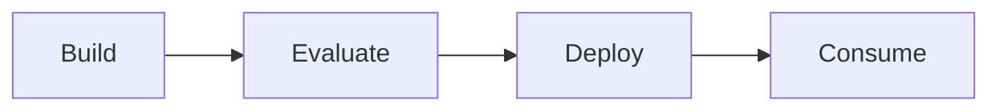

# Contoso Air: Microsoft Foundry Agent Lifecycle Workshop

A customer-ready, hands-on workshop for building, evaluating, deploying, and consuming AI agents with **Microsoft Foundry** and the **Microsoft Agent Framework** using **Python**.

> **Lifecycle theme:** **Build → Evaluate → Deploy → Consume**

---

## Start Here

New to the workshop? Follow these three steps in order:

1. **Check the [Prerequisites](docs/prerequisites.md)** – confirm Azure access and local tools.
2. **Complete the [Environment Setup](docs/environment-setup.md)** – sign in, create your Python environment, and configure `.env` files.
3. **Begin [Lab 1 – Flight Delay Communications Assistant](labs/lab1-flight-delay-communications/README.md)** – then continue to Lab 2.

If you get stuck, jump to [Where to Get Help](#where-to-get-help).

---

## Workshop Navigation

| # | Step | Estimated Time |
|---|------|----------------|
| 1 | [Prerequisites](docs/prerequisites.md) | Before the workshop |
| 2 | [Environment Setup](docs/environment-setup.md) | Before the workshop |
| 3 | [Architecture Overview](docs/architecture.md) | 5 min (intro) |
| 4 | [Lab 1 – Flight Delay Communications Assistant](labs/lab1-flight-delay-communications/README.md) | 35 min |
| 5 | [Lab 2 – Disruption Management Multi-Agent System](labs/lab2-disruption-management/README.md) | 45 min |
| 6 | [Wrap-Up](#wrap-up) | 5 min |

> The workshop is designed for a **90-minute** live session. Prerequisites and environment setup
> (~25 min) are intended to be completed **before** the session so the hands-on time is preserved.

Supporting material: [Workshop Agenda](docs/workshop-agenda.md) · [Instructor Guide](instructor-guide/) · [Slides](slides/workshop-overview.md)

---

## Workshop Flow

```text
Start Here
   │
   ▼
Prerequisites
   │
   ▼
Environment Setup
   │
   ▼
Lab 1 – Flight Delay Communications Assistant
   │
   ▼
Lab 2 – Disruption Management Multi-Agent System
   │
   ▼
Wrap-Up
```

---

## Workshop Overview

Contoso Air wants to improve operational resilience with AI agents. Over two labs you evolve a single
prompt-based agent into a coordinated, multi-agent disruption-management system, experiencing the full
Microsoft Foundry agent lifecycle along the way.

- **Lab 1** solves a narrow but valuable problem: generating consistent flight delay communications.
- **Lab 2** evolves the solution into a multi-agent system with specialist agents and an orchestrator.

### Audience

- Technical architects
- Developers and AI engineers
- Solution architects
- Teams new to Microsoft Foundry and the Microsoft Agent Framework

---

## Learning Objectives

By the end of the workshop, participants can:

- Create agents in Microsoft Foundry
- Configure instructions and behavior
- Run and interpret evaluations
- Deploy agent versions
- Call deployed agents from Python
- Build agents with the Microsoft Agent Framework
- Implement multi-agent orchestration
- Explain when to use prompt-based vs multi-agent designs

---

## Architecture Overview



| Dimension | Lab 1 Prompt Agent | Lab 2 Multi-Agent System |
|---|---|---|
| Build speed | Very fast | Moderate |
| Architecture | Single prompt agent | Orchestrated specialists |
| Knowledge separation | Low | High |
| Best for | Consistent narrow tasks | Broader multi-domain decisions |
| Deployment target | Foundry managed agent | Foundry hosted orchestrator |

See the full [Architecture Overview](docs/architecture.md) for diagrams, evaluation strategy, and deployment guidance.

---

## Agenda

The workshop is a **90-minute** hands-on session. Prerequisites and environment setup are completed
**before** the session so all 90 minutes are spent on the labs and discussion.

| Time | Segment |
|---|---|
| 0:00–0:05 | Introduction and architecture overview |
| 0:05–0:40 | Lab 1 – Flight Delay Communications Assistant |
| 0:40–1:25 | Lab 2 – Disruption Management Multi-Agent System |
| 1:25–1:30 | Wrap-up and Q&A |

A detailed breakdown is in the [Workshop Agenda](docs/workshop-agenda.md).

---

## Prerequisites

Before starting, you need:

- An Azure subscription with Microsoft Foundry access
- A Microsoft Foundry project with a chat-capable model deployment
- Python 3.10+, Azure CLI (`az`), Git, and a code editor

The full checklist is in [Prerequisites](docs/prerequisites.md).

---

## Repository Structure

```text
Foundry-Workshop/
│
├── README.md                       # You are here – workshop landing page
│
├── docs/                           # Shared workshop documentation
│   ├── prerequisites.md
│   ├── environment-setup.md
│   ├── architecture.md
│   └── workshop-agenda.md
│
├── labs/
│   ├── lab1-flight-delay-communications/
│   │   ├── README.md               # Lab overview and navigation
│   │   ├── lab-guide.md            # Step-by-step instructions
│   │   └── solution/               # Reference solution
│   │
│   └── lab2-disruption-management/
│       ├── README.md               # Lab overview and navigation
│       ├── lab-guide.md            # Step-by-step instructions
│       ├── starter-code/           # Author-it-yourself inputs
│       └── solution/               # Reference solution
│
├── instructor-guide/               # Timing, answer key, troubleshooting
└── slides/                         # Presentation outline
```

---

## Labs

| Lab | Focus | Pattern | Guide |
|---|---|---|---|
| [Lab 1](labs/lab1-flight-delay-communications/README.md) | Flight Delay Communications Assistant | Prompt-based agent | [lab-guide.md](labs/lab1-flight-delay-communications/lab-guide.md) |
| [Lab 2](labs/lab2-disruption-management/README.md) | Disruption Management | Multi-agent orchestration | [lab-guide.md](labs/lab2-disruption-management/lab-guide.md) |

Each lab includes a reference solution. Attempt the lab first, then compare with the solution folder if you get stuck.

---

## Wrap-Up

Close the workshop by reflecting on the architecture evolution:

- When is a prompt agent sufficient?
- When does decomposition into specialists improve reliability?
- Which evaluation metrics helped the most in finding weaknesses?

See the [Instructor Answer Key](instructor-guide/answer-key.md) for discussion prompts.

---

## Where to Get Help

- **Setup or sign-in issues:** [Environment Setup](docs/environment-setup.md) and [Troubleshooting Guide](instructor-guide/troubleshooting.md)
- **Lab-specific issues:** the **Troubleshooting** section at the end of each lab guide
- **Instructor support:** the [Instructor Guide](instructor-guide/)

---

## Instructor Materials

- [Workshop Agenda](docs/workshop-agenda.md)
- [Timing Guide](instructor-guide/timing.md)
- [Answer Key](instructor-guide/answer-key.md)
- [Troubleshooting Guide](instructor-guide/troubleshooting.md)
- [Slide Deck Outline](slides/workshop-overview.md)
- [Workshop Review & Findings Report](docs/workshop-review-findings.md)
