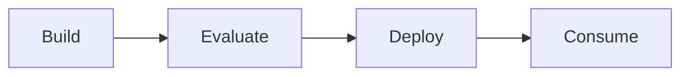
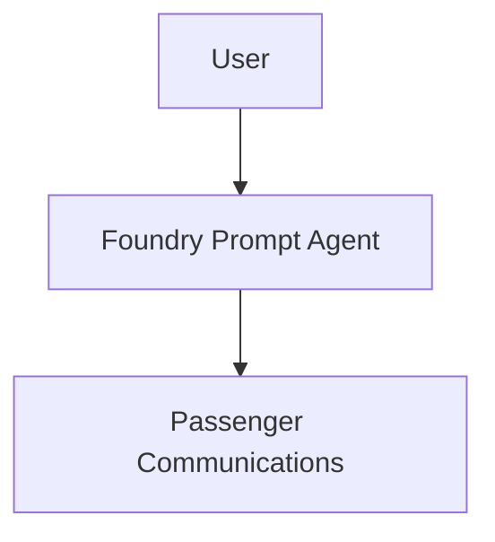
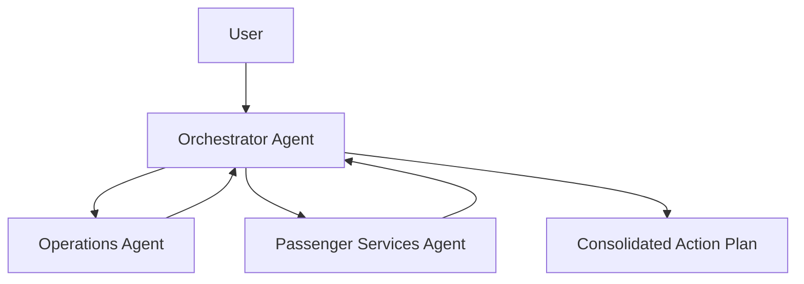

# Workshop Architecture Overview

This workshop uses a deliberate progression from a simple prompt-based agent to a multi-agent system.

## End-to-End Lifecycle

## Lab 1: Prompt-Based Agent

Use a native Foundry prompt agent for fast time to value.

### Why this pattern works

- Fastest path for first production use case
- Minimal code and setup
- Good fit for a single bounded task
- Easy to evaluate and iterate

## Lab 2: Multi-Agent System

Use Microsoft Agent Framework to decompose a broader operational problem.

### Why this pattern works

- Separates specialist responsibilities
- Improves control over domain-specific instructions
- Makes orchestration behavior explicit
- Helps compare single-agent and multi-agent tradeoffs

## Comparison Summary

| Dimension | Lab 1 Prompt Agent | Lab 2 Multi-Agent System |
|---|---|---|
| Build speed | Very fast | Moderate |
| Architecture | Single prompt agent | Orchestrated specialists |
| Knowledge separation | Low | High |
| Best for | Consistent narrow tasks | Broader multi-domain decisions |
| Deployment target | Foundry managed agent | Foundry hosted orchestrator |

## Evaluation Strategy

### Lab 1

Evaluate the generated passenger communications for:

- Relevance
- Accuracy
- Completeness
- Tone consistency
- Passenger friendliness

### Lab 2

Evaluate at three layers:

- Operations Agent: accuracy and completeness
- Passenger Services Agent: accuracy and policy adherence
- Orchestrator Agent: response quality, groundedness, consolidation quality, and hallucination reduction

## Deployment Strategy

- **Lab 1**: deploy the prompt agent directly from Foundry
- **Lab 2**: deploy only the orchestrator as a hosted agent; keep specialists internal to the workflow
