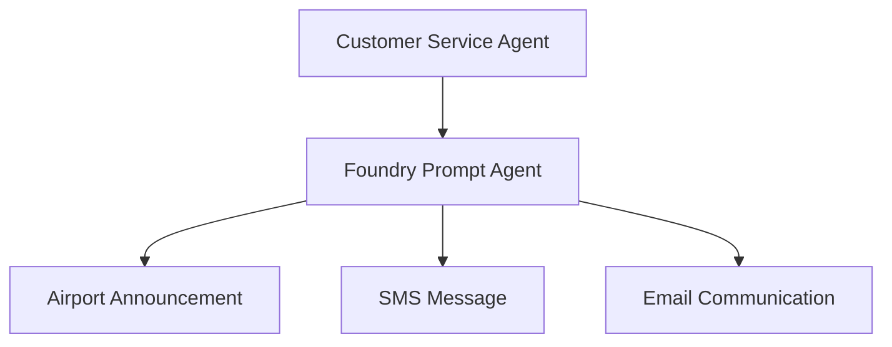

# Lab 1 - Flight Delay Communications Assistant

> **Navigation:** [Lab 1 Overview](README.md) · ⬅️ Previous: [Environment Setup](../../docs/environment-setup.md) · ➡️ Next: [Lab 2](../lab2-disruption-management/README.md)
>
> **Estimated duration:** 45–60 minutes

## Lab Summary

In this lab, you will create a **prompt-based Microsoft Foundry agent** for Contoso Air that produces passenger-friendly delay communications.

The lab demonstrates the full lifecycle:

**Build -> Evaluate -> Deploy -> Consume**

## Business Scenario

Contoso Air customer service teams need a reliable way to communicate flight delays to passengers.

The airline wants a Foundry-native agent that generates:

- Airport announcements
- SMS notifications
- Email communications

The agent must work from simple operational inputs and keep tone consistent.

## Architecture



## Learning Objectives

By the end of this lab, you will be able to:

1. Create a Foundry project
2. Configure model access
3. Create a prompt-based agent
4. Define system instructions
5. Test prompts
6. Run evaluations
7. Interpret evaluation results
8. Improve prompts
9. Deploy the agent
10. Consume the agent from Python

## Prerequisites

- Completed the setup steps in the [setup docs](../../docs/)
- Active Azure sign-in
- Access to a Foundry project and model deployment

## Step 1 - Create or Open a Foundry Project

1. Open Microsoft Foundry.
2. Create a new project or open an existing workshop project.
3. Note the **project endpoint**; you will need it later.
4. Confirm that a chat model deployment is available.

Suggested project name:

`contoso-air-workshop`

## Step 2 - Create the Prompt Agent

1. In Foundry, create a new **Prompt Agent**.
2. Name it:

`contoso-air-delay-comms`

3. Use your workshop chat model.
4. Leave tools disabled for this lab.
5. Add the following instructions.

## Recommended Agent Instructions

```text
You are the Contoso Air Flight Delay Communications Assistant.

Your job is to transform operational delay details into three passenger-facing outputs:
1. Airport announcement
2. SMS notification
3. Email communication

Rules:
- Always use a calm, empathetic, professional tone.
- Never invent facts that were not provided.
- Mention the flight number, delay duration, and delay reason when available.
- Keep the airport announcement concise and suitable for public address.
- Keep the SMS under 320 characters.
- Make the email detailed, friendly, and action-oriented.
- If the delay reason is weather, acknowledge that safety is the priority.
- Avoid operational jargon that passengers would not understand.
- End the email with a thank-you for patience.
- Format the response with clear headings:
  Airport Announcement
  SMS Message
  Email Communication
```

## Step 3 - Test the Agent

Use the following prompt in the Foundry playground:

```text
Flight Number: CA123
Delay Reason: Weather
Delay Duration: 2 Hours
```

### Expected Behavior

The response should include:

- A short announcement appropriate for an airport PA system
- A concise SMS update
- A longer customer email

### Example Quality Bar

**Airport Announcement**

Passengers traveling on Contoso Air flight CA123, please note that your flight is delayed by approximately 2 hours due to weather conditions. We appreciate your patience as safety remains our top priority.

**SMS Message**

Contoso Air update: Flight CA123 is delayed by 2 hours due to weather. Safety remains our priority. Please monitor airport displays and watch for additional updates.

**Email Communication**

A clear, empathetic email that explains the delay, reinforces safety, and tells customers where to watch for updates.

## Step 4 - Run Evaluations

Use the sample dataset in:

`solution/evaluation_dataset.jsonl`

### Dataset Fields

Each record contains:

- `query`: the disruption input sent to the agent
- `expected_response_characteristics`: what good output must contain

### Evaluation Metrics

Evaluate for:

- **Relevance** - Does the response match the scenario?
- **Accuracy** - Does it correctly reflect the provided details?
- **Completeness** - Are all three communication formats present?
- **Tone consistency** - Is the tone calm, empathetic, and professional?
- **Passenger friendliness** - Is the language easy for passengers to understand?

### Suggested Expected Outcomes

| Metric | Target Outcome |
|---|---|
| Relevance | High on all scenarios |
| Accuracy | High; no invented facts |
| Completeness | All outputs present on every run |
| Tone consistency | Consistently calm and empathetic |
| Passenger friendliness | High readability and low jargon |

### How to Interpret Results

- Low **accuracy** usually means the prompt is allowing invented details.
- Low **completeness** usually means the format instructions are not explicit enough.
- Low **tone consistency** means the empathy and style guidance should be strengthened.
- Low **passenger friendliness** means the prompt should discourage airline jargon.

## Step 5 - Improve the Prompt

If evaluation results are weak:

1. Tighten the output format requirements.
2. Re-state the no-invention rule.
3. Add explicit tone guidance.
4. Re-run the evaluation on the same dataset.

A strong workshop outcome is to show measurable improvement after one prompt revision.

## Step 6 - Deploy the Agent

1. Create a new deployment or published version for `contoso-air-delay-comms`.
2. Record the deployed version and agent ID.
3. Confirm the deployment is healthy.
4. Review the endpoint or project details shown in Foundry.

### Versioning Concepts to Explain

- Instructions can evolve over time.
- A new deployed version should be created after major prompt improvements.
- Keep version notes so operations teams know what changed.

## Step 7 - Consume the Agent from Python

Open the solution folder. From the repository root:

```bash
cd labs/lab1-flight-delay-communications/solution
python -m venv .venv
source .venv/bin/activate
pip install -r requirements.txt
cp .env.sample .env
```

> On Windows PowerShell, activate with `.venv\Scripts\Activate.ps1` and use `copy .env.sample .env`.

Populate `.env` with:

- `PROJECT_ENDPOINT`
- `AGENT_ID`

Run the sample:

```bash
python consume_agent.py --flight-number CA123 --delay-reason Weather --delay-duration "2 hours"
```

### Expected Output

The script should print the assistant response containing the three communication sections.

## Validation Checklist

Before moving to Lab 2, confirm that participants can:

- Show the prompt agent in Foundry
- Run a sample prompt successfully
- Import and review the evaluation dataset
- Explain at least one prompt improvement based on evaluation results
- Locate the deployed agent ID or endpoint details
- Run the Python consumer successfully

## Troubleshooting

### The response is too short

Add stronger format requirements and explicitly require all three outputs.

### The SMS is too long

Add a hard instruction to keep it under 320 characters.

### The agent invents compensation or refund details

Add: `Never mention compensation, vouchers, or rebooking unless it is explicitly provided in the input.`

### Python authentication fails

Run `az login` again and confirm the correct subscription is selected.

---

## Next Step

Continue to [Lab 2 - Disruption Management Multi-Agent System](../lab2-disruption-management/README.md).
