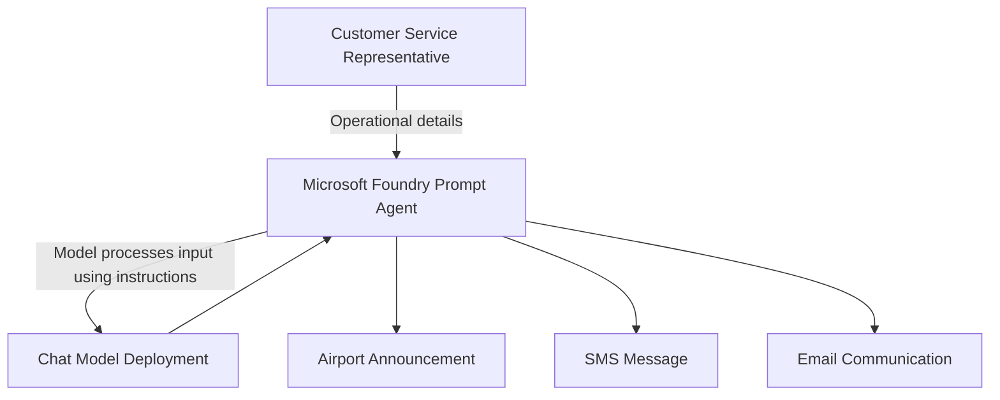

# Lab 1 - Flight Delay Communications Assistant

> **Navigation:** [Lab 1 Overview](README.md) · ⬅️ Previous: [Environment Setup](../../docs/environment-setup.md) · ➡️ Next: [Lab 2](../lab2-disruption-management/README.md)
>
> **Estimated duration:** 45–60 minutes
> **Level:** Beginner — no prior Microsoft Foundry experience required

## Lab Summary

In this hands-on lab you will build a **prompt-based Microsoft Foundry agent** for Contoso Air that turns
operational delay details into passenger-friendly communications. You will then **evaluate**, **deploy**, and
**consume** the agent from Python.

The lab demonstrates the complete agent lifecycle:

**Build → Evaluate → Deploy → Consume**

You can complete every step using only this guide. Each part follows the same structure so you always know
what you are doing and how to confirm success:

- **Objective** – what you are learning.
- **Instructions** – the exact actions to perform.
- **Example Input** – what to type or enter.
- **Expected Output** – what success looks like.
- **Validation** – how to verify the step is complete.
- **Troubleshooting** – common issues and fixes.

> **Screenshot placeholders.** This guide uses placeholders such as `[Insert Screenshot – Create Project Screen]`.
> Portal screens evolve over time, so capture your own screenshots as you go if you are preparing instructor
> material. The written steps are sufficient to complete the lab without images.

## How This Lab Fits the Workshop

Lab 1 is intentionally the **simpler** of the two labs. It focuses on Foundry-native skills:

- Foundry-native agent creation
- Prompt engineering
- Evaluation
- Deployment
- Consumption

Lab 2 then builds on these foundations with the **Microsoft Agent Framework**, multi-agent orchestration,
agent-to-agent communication, and more advanced evaluation patterns. Finish Lab 1 first so the progression
feels natural.

## Learning Objectives

By the end of this lab, you will be able to:

1. Create a Foundry project.
2. Create a Foundry agent.
3. Configure agent instructions.
4. Test prompts.
5. Improve agent behavior.
6. Run evaluations.
7. Analyze evaluation results.
8. Deploy an agent.
9. Consume the deployed endpoint from Python.

## Prerequisites

Before you begin, confirm you have completed the workshop setup:

- Completed the [Prerequisites](../../docs/prerequisites.md) checklist.
- Completed the [Environment Setup](../../docs/environment-setup.md).
- An active Azure sign-in (`az login`) with access to a Microsoft Foundry project.
- At least one chat-capable model deployment available in your project (for example `gpt-4o` or `gpt-4o-mini`).
- Python 3.10 or later installed locally.

---

# Part 1 – Understand the Business Scenario

### Objective

Understand the real-world problem this agent solves before you build it.

### Flight Delay Communications Assistant

Contoso Air wants an AI assistant that helps customer service representatives generate passenger
communications during flight disruptions. From a few operational details, the agent generates:

- **Airport announcements** – read aloud over the public address (PA) system at the gate.
- **SMS notifications** – short text messages sent to passengers' phones.
- **Customer emails** – longer, detailed messages with context and next steps.

### Why airlines need disruption communications

Flight disruptions are frequent and unavoidable: weather, technical inspections, crew availability, late
inbound aircraft, and airport congestion all cause delays. When a flight is disrupted, hundreds of passengers
need clear, timely information across multiple channels at once.

### Challenges with inconsistent messaging

When communications are written by hand under pressure, problems appear:

- The gate announcement says "30 minutes" while the SMS says "1 hour."
- Tone varies — some messages sound abrupt, others over-promise compensation.
- Important details (flight number, reason, expected duration) are missing.
- Staff spend time writing instead of helping passengers.

Inconsistent messaging erodes passenger trust at exactly the moment trust matters most.

### Benefits of AI-assisted communication generation

A prompt-based agent gives every representative the same high-quality starting point:

- **Consistent tone** – calm, empathetic, and professional every time.
- **Consistent facts** – the same flight number, reason, and duration across all three channels.
- **Speed** – three channel-ready messages from one short input.
- **Channel awareness** – a concise SMS, a brief PA announcement, and a detailed email.

### Why a prompt-based agent is sufficient

This use case does not require external data lookups, tools, or multiple coordinating agents. The
representative already knows the operational facts; the agent simply needs to **rephrase those facts** into
three well-written passenger communications. A single prompt-based agent is the right level of complexity —
which is why this is Lab 1. (Lab 2 introduces multi-agent orchestration when the problem genuinely needs it.)

### Realistic aviation examples

| Operational input | Communication need |
|---|---|
| Flight CA123 delayed 2 hours due to weather | Reassure passengers that safety is the priority |
| Flight CA456 delayed 45 minutes for a technical inspection | Explain the delay without alarming passengers |
| Flight CA789 delayed because crew are arriving on a late inbound flight | Set expectations without assigning blame |

### Validation

You can answer: *"Why does Contoso Air need this agent, and why is a single prompt-based agent enough?"*

---

# Part 2 – Explore the Solution Architecture

### Objective

Visualize what you are about to build before opening the portal.

### High-level flow

```text
Customer Service Agent
          │
          ▼
Microsoft Foundry Agent
          │
          ▼
Generated Communications
```

### Architecture diagram



### How the pieces fit together

- **User input** – The representative supplies operational facts: flight number, delay reason, and duration.
- **Prompt instructions** – The agent's *system instructions* tell the model exactly how to behave: what to
  produce, what tone to use, and what rules to follow. This is the part you engineer in this lab.
- **Model processing** – The chat model deployment combines the user input with the system instructions and
  generates text.
- **Generated outputs** – Three passenger communications: an airport announcement, an SMS, and an email.

### Validation

You can explain, in one sentence each, the role of **user input**, **prompt instructions**, **model
processing**, and **generated outputs**.

---

# Part 3 – Create a Microsoft Foundry Project

### Objective

Create the Foundry project that will host your agent.

### Instructions

1. Open **[Microsoft Foundry](https://ai.azure.com)** in your browser and **sign in** with your Azure account.
2. From the Foundry home page, select **+ Create project** (or **New project**).
3. Enter a **project name**.
4. If prompted, choose or create the **hub / resource** that the project belongs to.
5. Select a **region** that offers the chat models you plan to use.
6. Review the settings and select **Create**. Wait for the project to finish provisioning.
7. When the project opens, find the **project endpoint** on the project **Overview** page and copy it. You
   will need it in Part 12.

`[Insert Screenshot – Create Project Screen]`

`[Insert Screenshot – Project Overview With Endpoint]`

### Example Input

| Field | Value to enter | Why it matters |
|---|---|---|
| Project name | `contoso-air-workshop` | A clear name makes the project easy to find later |
| Region | A region offering your chat model | Model availability varies by region |
| Hub / resource | Your workshop hub (create if none) | The hub provides shared security and connections |

### Expected Output

- The project opens to its **Overview** page.
- A **project endpoint** URL is shown, similar to
  `https://<your-foundry-resource>.services.ai.azure.com/api/projects/<your-project>`.

### Validation

- The project appears in your Foundry project list.
- You have copied the project endpoint to a safe place (you will paste it into a `.env` file later).
- At least one chat model deployment is available (check the **Models + endpoints** or **Deployments** area).
  If none exists, deploy one (for example `gpt-4o-mini`) before continuing.

### Troubleshooting

| Symptom | Resolution |
|---|---|
| **Create project** is greyed out | You may lack permission. Confirm you have Azure AI Developer (or equivalent) access from [Prerequisites](../../docs/prerequisites.md). |
| No region offers the model you want | Pick a different region, or choose a different chat model that is available. |
| No model deployment is listed | Open **Models + endpoints**, select **Deploy model**, and deploy a chat model such as `gpt-4o-mini`. |

---

# Part 4 – Create the Flight Delay Communications Agent

### Objective

Create a prompt-based agent and give it the instructions that define its behavior.

### Instructions

1. In your project, open the **Agents** section.
2. Select **+ New agent** (or **Create agent**).
3. Give the agent a **name**.
4. Select your workshop **chat model** deployment.
5. Leave **tools** disabled — this is a pure prompt-based agent.
6. Paste the system prompt below into the **Instructions** field.
7. **Save** the agent.

`[Insert Screenshot – Create Agent Screen]`

`[Insert Screenshot – Agent Instructions Field]`

### Example Input

| Field | Value to enter |
|---|---|
| Agent name | `contoso-air-delay-comms` |
| Model | Your workshop chat model (for example `gpt-4o-mini`) |
| Tools | None (leave disabled) |

#### Complete system prompt

```text
You are the Flight Delay Communications Assistant for Contoso Air.

Your responsibility is to generate professional passenger communications during flight disruptions.

For every request, generate exactly three outputs, in this order, each under its own heading:

1. Airport Announcement
2. SMS Message
3. Email Communication

Rules:
- Always use a calm, empathetic, professional, and passenger-friendly tone.
- Never invent facts that were not provided. Do not promise compensation, vouchers,
  rebooking, or hotels unless those details are explicitly given in the input.
- Mention the flight number, delay duration, and delay reason whenever they are provided.
- Keep the Airport Announcement concise and suitable for reading aloud over a PA system.
- Keep the SMS Message under 320 characters.
- Make the Email Communication detailed, friendly, and action-oriented, and end it with a
  thank-you for the passenger's patience.
- If the delay reason is weather, acknowledge that passenger safety is the top priority.
- Avoid operational jargon that passengers would not understand.
```

### Why each instruction exists

| Instruction | Purpose |
|---|---|
| "generate exactly three outputs … each under its own heading" | Guarantees completeness and a predictable, parseable format. |
| "Never invent facts … Do not promise compensation…" | Prevents hallucinated promises that the airline cannot honor. |
| "Mention the flight number, delay duration, and delay reason" | Ensures the facts the representative supplied actually appear. |
| "Keep the SMS Message under 320 characters" | Respects SMS channel limits. |
| "If the delay reason is weather, acknowledge … safety…" | Aligns messaging with airline values during weather events. |
| "Avoid operational jargon" | Keeps messages understandable to passengers. |

### Expected Output

The agent is created and shown in the **Agents** list with the instructions saved.

### Validation

- The agent `contoso-air-delay-comms` appears in your project's Agents list.
- Re-opening the agent shows the full system prompt in the Instructions field.

### Troubleshooting

| Symptom | Resolution |
|---|---|
| No model appears in the dropdown | Deploy a chat model first (see Part 3 troubleshooting). |
| Instructions look truncated after saving | Re-open the agent and paste the full prompt again; confirm you copied the entire code block. |

---

# Part 5 – Test the Agent

### Objective

Confirm the agent produces all three communications, then test it across multiple disruption scenarios.

### Instructions

1. Open the agent in the Foundry **playground** (the chat/test pane next to the agent).
2. Paste **Scenario 1** below and send it.
3. Review the response against the **Expected Output**.
4. Repeat for **Scenario 2** and **Scenario 3**.

`[Insert Screenshot – Agent Playground Response]`

### Example Input

#### Scenario 1 – Weather delay

```text
Flight Number: CA123
Destination: London
Delay Reason: Weather
Delay Duration: 2 Hours
```

#### Scenario 2 – Technical issue

```text
Flight Number: CA456
Destination: New York
Delay Reason: Technical inspection
Delay Duration: 45 Minutes
```

#### Scenario 3 – Crew availability issue

```text
Flight Number: CA789
Destination: Paris
Delay Reason: Crew arriving on a late inbound flight
Delay Duration: 1 Hour 15 Minutes
```

### Expected Output

Each response should contain three clearly headed sections. For Scenario 1, a strong response looks like:

**Airport Announcement**

> Passengers traveling on Contoso Air flight CA123 to London, please note that your flight is delayed by
> approximately 2 hours due to weather conditions. We appreciate your patience as safety remains our top
> priority.

**SMS Message**

> Contoso Air update: Flight CA123 to London is delayed by 2 hours due to weather. Safety remains our
> priority. Please watch airport displays for further updates.

**Email Communication**

> A longer, empathetic email that restates the flight number, destination, reason, and duration; reassures
> passengers that safety is the priority; explains where to watch for updates; and ends by thanking the
> passenger for their patience.

### What good responses look like

- All three formats are present and correctly labelled.
- The flight number, destination, reason, and duration from the input all appear.
- The tone is calm and empathetic, never abrupt.
- No invented facts (no surprise vouchers, refunds, or rebooking).
- The SMS is short; the announcement is brief; the email is the most detailed.

### Validation

You ran all three scenarios and each returned an airport announcement, an SMS, and an email that reflect the
supplied details.

### Troubleshooting

| Symptom | Resolution |
|---|---|
| Only one or two formats appear | Confirm the "exactly three outputs … each under its own heading" rule is in the instructions. |
| The agent invents a refund or voucher | Confirm the no-invention rule is present; you will reinforce this in Part 6. |
| The SMS is very long | The 320-character rule may be missing — re-check the instructions. |

---

# Part 6 – Improve the Prompt

### Objective

Learn the core skill of **prompt iteration**: review outputs, identify a weakness, change the instructions,
and compare the result. This is one of the most important moments in the lab.

### Instructions

1. Re-read the Scenario 2 (technical inspection) response from Part 5.
2. Identify an improvement. A common one: passengers may worry that "technical inspection" means the aircraft
   is unsafe, so the message should reassure them.
3. Update the agent instructions with a more specific rule.
4. Re-run Scenario 2 and compare the new output to the old one.

### Initial Prompt

The instructions from Part 4, with this general rule:

```text
- Avoid operational jargon that passengers would not understand.
```

### Improved Prompt

Add a more specific reassurance rule below it:

```text
- Avoid operational jargon that passengers would not understand.
- When the delay reason involves a technical or maintenance issue, reassure passengers that the
  inspection is a routine safety precaution and that the aircraft will only depart when fully cleared.
```

### Example Input

Re-send **Scenario 2** from Part 5:

```text
Flight Number: CA456
Destination: New York
Delay Reason: Technical inspection
Delay Duration: 45 Minutes
```

### Result Comparison

| | Before improvement | After improvement |
|---|---|---|
| Tone on technical delays | Neutral; may sound worrying | Reassuring and safety-focused |
| Passenger concern | "Is the plane broken?" | "This is a routine safety check." |
| Wording | "delayed due to a technical inspection" | "delayed for a routine safety inspection; the aircraft will depart once fully cleared" |

### Expected Output

After the change, the Scenario 2 response explicitly frames the technical inspection as a routine safety
precaution, reducing passenger anxiety while keeping all three formats.

### Validation

You can show the **before** and **after** responses and explain in one sentence how the instruction change
improved the output.

### Troubleshooting

| Symptom | Resolution |
|---|---|
| Output did not change | Make sure you saved the instructions and started a fresh message in the playground. |
| The new rule appears even for weather delays | Confirm the rule is conditional ("When the delay reason involves a technical or maintenance issue…"). |

---

# Part 7 – Create an Evaluation Dataset

### Objective

Build a small, repeatable dataset so you can measure the agent's quality objectively instead of judging it by
"feel."

### Instructions

A ready-made dataset is provided at `solution/evaluation_dataset.jsonl`. Open it to see the format, then
confirm it covers the scenarios below. You can add your own rows in the same format.

Each line is a JSON object with:

- `query` – the disruption input sent to the agent.
- `expected_response_characteristics` – a list of things a good response must contain.

### Example Input

The dataset includes at least five scenarios:

| # | Scenario | Expected Outcome |
|---|---|---|
| 1 | Weather delay | Clear passenger communication; references weather and safety |
| 2 | Crew availability | All three formats; states the delay duration; no blame |
| 3 | Late inbound aircraft | Explains the delay without blame; clear customer-facing language |
| 4 | Cancellation | Appropriate apology and next steps; no invented compensation |
| 5 | Gate change | Accurate gate instructions in all three formats |
| 6 | Airport congestion | Concise SMS; brief announcement; detailed email |

A single row looks like this:

```json
{"query": "Flight Number: CA601\nDelay Reason: Gate change\nNew Gate: B12", "expected_response_characteristics": ["States the new gate B12", "Includes all three formats", "Gives clear directions to the new gate"]}
```

### Expected Output

A `.jsonl` file with one JSON object per line, covering five or more distinct disruption scenarios.

### Validation

- `solution/evaluation_dataset.jsonl` opens without JSON errors.
- It contains at least five scenarios, including the weather, cancellation, and gate-change cases above.

### Troubleshooting

| Symptom | Resolution |
|---|---|
| The file fails to parse | Each line must be a complete, valid JSON object on its own line. Do not add trailing commas. |
| A row spans multiple lines | Keep each JSON object on a single line in `.jsonl` files. |

---

# Part 8 – Run Evaluations

### Objective

Run an evaluation against your agent and review the scored results.

### Instructions

1. In your project, open the **Evaluation** section.
2. Select **+ New evaluation** (or **Create evaluation**).
3. Choose your agent `contoso-air-delay-comms` as the target.
4. Upload or select the dataset `evaluation_dataset.jsonl` from Part 7.
5. Select the evaluation **criteria** (described below).
6. Start the evaluation run and wait for it to finish.
7. Open the completed run to review per-scenario scores.

`[Insert Screenshot – Create Evaluation Screen]`

`[Insert Screenshot – Evaluation Results Summary]`

### Evaluation criteria explained

| Criterion | What it measures |
|---|---|
| **Relevance** | Does the response address the specific disruption scenario? |
| **Accuracy** | Does it correctly reflect the supplied flight number, reason, and duration, with no invented facts? |
| **Completeness** | Are all three formats (announcement, SMS, email) present on every run? |
| **Tone consistency** | Is the tone consistently calm, empathetic, and professional? |

### Example Input

The dataset from Part 7 (`evaluation_dataset.jsonl`).

### Expected Output

An evaluation run that completes successfully and shows a score for each criterion across every scenario, plus
a summary view.

### Validation

- The evaluation run status is **Completed**.
- You can see per-criterion results for each row of the dataset.

### Troubleshooting

| Symptom | Resolution |
|---|---|
| The run fails immediately | Confirm the dataset uploaded correctly and the agent/model is still deployed. |
| Scores are missing for some rows | A malformed dataset line may have been skipped — re-validate the `.jsonl` (Part 7). |
| Evaluation option is not visible | Confirm your project role allows running evaluations (see [Prerequisites](../../docs/prerequisites.md)). |

---

# Part 9 – Analyze Evaluation Results

### Objective

Turn evaluation scores into concrete prompt improvements, completing a full improvement cycle.

### The improvement cycle

```text
Evaluate
    ↓
Identify Issue
    ↓
Improve Prompt
    ↓
Re-Evaluate
```

### Instructions

1. **Review metrics.** Look at which criterion scored lowest and on which scenarios.
2. **Identify weaknesses.** Map the low score to a likely cause using the table below.
3. **Improve prompts.** Edit the agent instructions to address the weakness.
4. **Re-run evaluations.** Repeat Part 8 on the same dataset and compare scores.

### How to interpret common results

| Low score in… | Likely cause | Prompt fix |
|---|---|---|
| **Accuracy** | The prompt allows invented details | Reinforce the no-invention rule; forbid mentioning compensation unless supplied |
| **Completeness** | Format rules are not explicit enough | Restate "exactly three outputs, each under its own heading" |
| **Tone consistency** | Empathy guidance is too weak | Strengthen the tone rules and add a weather-safety reminder |
| **Relevance** | The agent drifts from the scenario | Tell it to ground every output in the supplied facts only |

### Expected Output

A second evaluation run that shows measurable improvement on the criterion you targeted, compared to the first
run.

### Why this matters in real-world AI projects

Production AI is never "write the prompt once and ship it." Teams continuously evaluate against representative
datasets, find weaknesses, improve instructions, and re-evaluate to confirm the change actually helped. This
**evaluate → improve → re-evaluate** loop is how AI quality is managed over time.

### Validation

You can show two evaluation runs (before and after) and explain which instruction change improved which
metric.

### Troubleshooting

| Symptom | Resolution |
|---|---|
| Scores did not improve | The fix may not target the real cause — re-read the lowest-scoring responses and adjust the most specific rule. |
| One metric improved but another dropped | Prompt changes can trade off; aim for the smallest change that fixes the target metric without harming the others. |

---

# Part 10 – Deploy the Agent

### Objective

Publish a deployed version of the agent so it can be called from outside the playground.

### Instructions

1. Open the agent `contoso-air-delay-comms`.
2. Select **Deploy** (or **Publish version**) to create a deployment.
3. Configure the deployment settings (name/version) as prompted.
4. Confirm the deployment and wait for it to report a healthy/succeeded status.
5. Record the **Agent ID** and confirm the **project endpoint** from Part 3 — you need both for Part 12.

`[Insert Screenshot – Deploy Agent Screen]`

`[Insert Screenshot – Deployment Status Healthy]`

### Versioning guidance

- Instructions evolve over time, so create a **new version** after major prompt improvements (like the one in
  Part 6 or Part 9).
- Keep short version notes describing what changed so operations teams know which behavior is live.

### Example Input

| Field | Value |
|---|---|
| Deployment / version name | `v1` (or a descriptive name) |
| Agent | `contoso-air-delay-comms` |

### Expected Output

A deployed agent version with a status of **Succeeded** / **Healthy**, and a visible **Agent ID**.

### Validation

- The deployment status is healthy.
- You have copied the **Agent ID** and the **project endpoint**.

### Troubleshooting

| Symptom | Resolution |
|---|---|
| Deployment status is failed | Re-check that the underlying model deployment is still available, then redeploy. |
| You cannot find the Agent ID | It is shown on the agent's details/deployment page; copy the full identifier. |

---

# Part 11 – Test the Deployment

### Objective

Verify the deployed agent works before calling it from code.

### Instructions

1. From the deployed agent's page, open its **test** / **playground** view.
2. Send **Scenario 1** from Part 5 again.
3. Confirm a complete response is generated by the *deployed* version.

### Example Input

```text
Flight Number: CA123
Destination: London
Delay Reason: Weather
Delay Duration: 2 Hours
```

### Expected Output

The deployed agent returns all three communications, matching the quality bar from Part 5.

### Validation

- The deployment status is **Succeeded**.
- The endpoint is reachable from the test view.
- A response with all three formats is generated successfully.

### Troubleshooting

| Symptom | Resolution |
|---|---|
| No response from the deployed agent | Confirm the deployment is healthy (Part 10) and the model deployment is available. |
| Response differs from the playground | You may be testing an older version — confirm you deployed the latest instructions. |

---

# Part 12 – Consume the Agent Using Python

### Objective

Call the deployed agent from a Python application using the provided `consume_agent.py` client.

### Instructions

From the repository root, set up the Python environment:

```bash
cd labs/lab1-flight-delay-communications/solution
python -m venv .venv
source .venv/bin/activate
pip install -r requirements.txt
cp .env.sample .env
```

> On Windows PowerShell, activate with `.venv\Scripts\Activate.ps1` and copy the file with
> `copy .env.sample .env`.

Open `.env` and populate it with the values you recorded earlier:

```text
PROJECT_ENDPOINT=https://<your-foundry-resource>.services.ai.azure.com/api/projects/<your-project>
AGENT_ID=<your-prompt-agent-id>
```

The reference client is [`solution/consume_agent.py`](solution/consume_agent.py). Its key sections are:

- **Authentication** – uses `DefaultAzureCredential`, which reuses your `az login` session:

  ```python
  credential = DefaultAzureCredential(exclude_interactive_browser_credential=False)
  project_client = AIProjectClient(endpoint=endpoint, credential=credential)
  ```

- **Endpoint invocation & sending requests** – creates a thread, posts the user message, and runs the agent:

  ```python
  thread = project_client.agents.threads.create()
  project_client.agents.messages.create(
      thread_id=thread.id, role=MessageRole.USER, content=build_prompt(args),
  )
  run = project_client.agents.runs.create_and_process(
      thread_id=thread.id, agent_id=agent_id,
  )
  ```

- **Receiving responses** – reads the first assistant message and prints its text:

  ```python
  messages = project_client.agents.messages.list(thread_id=thread.id)
  assistant_message = first_assistant_message(messages)
  print("\n".join(extract_text_fragments(assistant_message)).strip())
  ```

- **Error handling** – missing environment variables, failed runs, and empty responses all raise clear errors,
  and any exception is printed to `stderr` with a non-zero exit code.

### Example Input

The client accepts structured flags:

```bash
python consume_agent.py --flight-number CA123 --delay-reason Weather --delay-duration "2 hours"
```

### Expected Output

The script prints the assistant response containing the three communication sections (Airport Announcement,
SMS Message, Email Communication).

### Validation

- `pip install -r requirements.txt` completes without errors.
- `.env` contains a real `PROJECT_ENDPOINT` and `AGENT_ID`.

### Troubleshooting

| Symptom | Resolution |
|---|---|
| `Missing required environment variable` | Confirm `.env` exists and contains both `PROJECT_ENDPOINT` and `AGENT_ID`. |
| `DefaultAzureCredential failed` | Run `az login` again and confirm the correct subscription is selected. |
| `Agent run failed` | Verify `AGENT_ID` points to the deployed version and the model deployment is healthy. |

---

# Part 13 – Run the Python Application

### Objective

Run the client end-to-end and confirm the deployed agent responds.

### Instructions

With the virtual environment activated and `.env` populated, run:

#### Windows

```text
python consume_agent.py --flight-number CA123 --delay-reason Weather --delay-duration "2 hours"
```

#### macOS / Linux

```bash
python consume_agent.py --flight-number CA123 --delay-reason Weather --delay-duration "2 hours"
```

You can also pass a custom message directly:

```bash
python consume_agent.py --message "Flight Number: CA456
Delay Reason: Technical inspection
Delay Duration: 45 minutes"
```

### Expected Output

The terminal prints a response similar to:

```text
Airport Announcement
Passengers traveling on Contoso Air flight CA123 ... delayed by approximately 2 hours due to weather ...

SMS Message
Contoso Air update: Flight CA123 is delayed by 2 hours due to weather ...

Email Communication
Dear Passenger, ... Thank you for your patience.
```

### Validation

- The command exits with code `0`.
- The printed output contains all three communication sections.

### Troubleshooting

| Symptom | Resolution |
|---|---|
| Command prints `Error: ...` and exits non-zero | Read the message — it names the cause (missing env var, auth failure, or failed run). |
| Authentication fails | Run `az login`, confirm the subscription, then re-run. |
| Output is empty or missing a section | Confirm the deployed agent still requires all three formats; redeploy if you changed instructions. |

---

# Part 14 – Validation Checkpoint

### Objective

Confirm you have completed the full lifecycle: **Build → Evaluate → Deploy → Consume**.

You should be able to demonstrate a working Foundry agent, evaluation results, a successful deployment, and
successful endpoint consumption from Python.

```text
☐ Agent Created

☐ Agent Tested

☐ Evaluation Completed

☐ Deployment Successful

☐ Endpoint Consumed Using Python
```

### Validation

If every box above is checked, you have completed Lab 1. If any box is unchecked, return to the matching part
and use its Troubleshooting section.

---

# Part 15 – Challenge Exercise (Optional)

### Objective

Extend the agent with a more advanced capability. This challenge is **optional** and not required to complete
the workshop.

### Choose one enhancement

1. **Multiple languages** – Update the instructions so the agent also produces a translated version of each
   communication (for example English and Spanish), and test with a scenario.
2. **Additional channels** – Add a fourth output, a **Mobile App push notification**, with its own length and
   tone rules, and confirm all four formats appear.
3. **Airline branding guidelines** – Add brand voice rules (for example a standard sign-off line and approved
   phrasing) and verify they appear consistently across all outputs.

### Validation

Your chosen enhancement appears reliably across multiple test scenarios without breaking the original three
communications.

---

## Next Step

Continue to [Lab 2 – Disruption Management Multi-Agent System](../lab2-disruption-management/README.md), where
you will build a multi-agent solution with the **Microsoft Agent Framework**, orchestration, agent-to-agent
communication, and advanced evaluation patterns.
