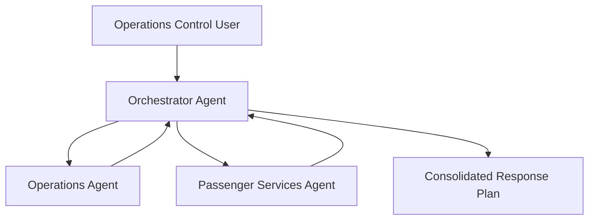

# Lab 2 - Airline Disruption Management Multi-Agent System

> **Navigation:** [Lab 2 Overview](README.md) · ⬅️ Previous: [Lab 1](../lab1-flight-delay-communications/README.md) · ➡️ Next: [Wrap-Up](../../README.md#wrap-up)
>
> **Estimated duration:** 45 minutes in Workshop Mode · 90–120 minutes in Self-Paced Build-From-Scratch Mode

## Choose Your Mode

This lab supports two modes so it fits both a live 90-minute workshop and self-paced study.

### 🚀 Workshop Mode (recommended for the live 90-minute session) — ~45 min

Use the prebuilt code in [`solution/`](solution/). You will **run** the agents and **read** the code
side-by-side with this guide, instead of typing every file. The live focus stays on **concepts** —
grounding, orchestration, evaluation, and deployment — not on syntax.

Quick start:

```bash
cd labs/lab2-disruption-management/solution
python -m venv .venv
source .venv/bin/activate          # Windows: .venv\Scripts\Activate.ps1
pip install -r requirements.txt
cp .env.sample .env                # Windows: copy .env.sample .env
# Edit .env with your FOUNDRY_PROJECT_ENDPOINT and FOUNDRY_MODEL values.
python operations_agent.py         # see Part 5 in this guide
python passenger_agent.py          # see Part 6
RUN_MODE=local python orchestrator_agent.py   # see Part 9
```

Then follow Parts 1, 5, 6, 7, 8 (read-along), 9, 11 (discussion), 12 (instructor demo), and 13 of this
guide. You can skip Parts 2–4 entirely (they are folder/dependency setup already done in `solution/`).

### 🛠️ Self-Paced Build-From-Scratch Mode — 90–120 min

Work through Parts 1–13 in order, starting from an empty folder and creating every file yourself.
The `solution/` folder is only a reference if you get stuck. This is the right mode outside a
live workshop, when learning the framework end-to-end is the goal.

## How to Use This Guide

In **Self-Paced Build-From-Scratch Mode**, this is a hands-on, build-it-yourself walkthrough.
You start from an empty folder and create every file by hand, one step at a time, until you have
a complete multi-agent solution. You do **not** need to open the `solution/` folder to finish the
lab in this mode — every command, every file, and every line of code you need is printed in this
guide.

In **Workshop Mode**, the same parts are read as a walkthrough of the prebuilt code in `solution/`
so the live focus stays on concepts. Use the section headers to follow along; you only need to
**run** the commands in the Validation blocks, not retype the code.

Each part follows the same instructional pattern, consistent with Lab 1:

1. **Objective** – what you will learn.
2. **Instructions** – the exact actions to perform.
3. **Code** – the complete code to type or paste.
4. **Validation** – how to confirm the step worked.
5. **Troubleshooting** – common issues and fixes.
6. **Expected Outcome** – what you should see.

Work through the parts in order. Do not skip ahead, because each file builds on the previous one.

### Lab Lifecycle

You will follow the same lifecycle as Lab 1, applied to a multi-agent system:

**Understand → Build → Test → Evaluate → Deploy → Consume → Validate**

### Prerequisites

- Completed [Lab 1](../lab1-flight-delay-communications/README.md)
- Completed the [Environment Setup](../../docs/environment-setup.md)
- Active Azure sign-in (`az login`) with access to a Foundry project and a chat model deployment
- Python 3.10 or later installed

---

# Part 1 – Understand the Scenario

## Objective

Understand the business problem, why multiple agents help, the role of each agent, and the overall
architecture **before** you write any code.

## The Business Problem

A severe weather event delays **Contoso Air flight CA123 by two hours**.

The Operations Control Center needs a fast, reliable answer to three questions at the same time:

- **What operational actions are required?** (gates, crew, turnaround, dispatch)
- **What passenger actions are required?** (communications, rebooking, vouchers, hotels)
- **What is the single, coordinated response plan?**

Today these answers come from different teams reading different manuals. That is slow, and the two
viewpoints can conflict (for example, operations commits to a boarding time before passenger
services has messaged travelers).

## Why Multiple Agents?

A single prompt agent (like Lab 1) works well for one narrow task. This problem is broader: it spans
**two different knowledge domains** with different rules and different "do not invent" guardrails.

Splitting the work into specialists gives you:

- **Separation of knowledge** – each agent reads only its own manual.
- **Control** – you can tune each specialist's instructions independently.
- **Explicit orchestration** – you decide how the viewpoints are combined.
- **Better evaluation** – you can score each tier (operations, passenger, orchestrator) separately.

## Role of Each Agent

| Agent | Knowledge Source | Responsibility |
|---|---|---|
| **Operations Agent** | `operations_manual.md` | Delay procedures, gate management, turnaround, crew, diversions |
| **Passenger Services Agent** | `passenger_guidelines.md` | Communications, vouchers, rebooking, hotels, service recovery |
| **Orchestrator Agent** | (none of its own) | Runs both specialists and consolidates their findings into one plan |

A key rule: the **orchestrator does not invent policy**. It may only synthesize what the specialists
returned.

## Architecture



The orchestrator fans out to both specialists **concurrently**, then aggregates their answers into a
single response with four sections:

- Operational Actions
- Passenger Actions
- Recommended Response Plan
- Immediate Next 30 Minutes

## Validation

You are ready to continue when you can answer, in your own words:

- Why is a single prompt agent not the best fit here?
- What knowledge source does each specialist use?
- What is the orchestrator allowed (and not allowed) to do?

## Expected Outcome

You understand the scenario, the three agents, and the final response format you are about to build.

---

# Part 2 – Create the Project

## Objective

Create an isolated project folder and a Python virtual environment.

## Instructions

Pick a working location (for example your home directory or `Desktop`), then create the project
folder and a virtual environment. Use the tab that matches your operating system.

### macOS / Linux

```bash
mkdir disruption-management
cd disruption-management

python -m venv .venv
source .venv/bin/activate
```

### Windows (PowerShell)

```powershell
mkdir disruption-management
cd disruption-management

python -m venv .venv
.venv\Scripts\Activate.ps1
```

### Windows (Command Prompt)

```bat
mkdir disruption-management
cd disruption-management

python -m venv .venv
.venv\Scripts\activate.bat
```

> If PowerShell blocks activation with a script-execution error, run:
> `Set-ExecutionPolicy -Scope Process -ExecutionPolicy Bypass` and try again.

## Validation

Your shell prompt should now start with `(.venv)`. Confirm the interpreter:

```bash
python --version
```

## Troubleshooting

| Symptom | Fix |
|---|---|
| `python: command not found` | Try `python3` instead, or install Python 3.10+. |
| Activation does nothing | Make sure you are inside the `disruption-management` folder. |
| PowerShell `running scripts is disabled` | Run the `Set-ExecutionPolicy` command above. |

## Expected Outcome

An empty `disruption-management` folder with an activated `.venv` virtual environment.

---

# Part 3 – Install Dependencies

## Objective

Install the Microsoft Agent Framework and supporting libraries your agents need.

## Instructions

Create a `requirements.txt` file in the project folder with the contents below, then install it.

## Code

`requirements.txt`

```text
agent-framework>=1.0.0
agent-framework-foundry>=1.0.0
agent-framework-foundry-hosting>=1.0.0
azure-identity>=1.17.1
python-dotenv>=1.0.1
requests>=2.32.0
```

What each package is for:

| Package | Purpose |
|---|---|
| `agent-framework` | Core Microsoft Agent Framework: the `Agent` class and orchestration builders. |
| `agent-framework-foundry` | The `FoundryChatClient` that connects agents to a Foundry model deployment. |
| `agent-framework-foundry-hosting` | Hosts your orchestrator as a Foundry Responses API endpoint. |
| `azure-identity` | `DefaultAzureCredential` for signing in with your `az login` session. |
| `python-dotenv` | Loads configuration from a local `.env` file. |
| `requests` | HTTP client used later to call the deployed endpoint. |

Install everything:

```bash
pip install -r requirements.txt
```

## Validation

```bash
pip show agent-framework
```

You should see the package name and an installed version of `1.0.0` or higher.

## Troubleshooting

| Symptom | Fix |
|---|---|
| `No matching distribution found` | Confirm the `.venv` is active and your `pip` is up to date: `python -m pip install --upgrade pip`. |
| SSL / proxy errors | Re-run the install on a network that allows access to the Python Package Index. |
| Install is very slow | This is normal the first time; the framework has several dependencies. |

## Expected Outcome

All packages install successfully and `pip show agent-framework` reports an installed version.

---

# Part 4 – Create Knowledge Sources

## Objective

Create the two knowledge files that ground your specialist agents. These are the **only** knowledge
sources used in the lab. Type or paste them exactly — do not download them.

## Instructions

In the project folder, create `operations_manual.md` and `passenger_guidelines.md` with the full
contents below.

## Code

`operations_manual.md`

```markdown
# Contoso Air Operations Manual

## Delay Procedures

- Confirm the disruption cause with operations control before customer messages are released.
- Update the estimated departure time as soon as a credible estimate exists.
- Notify dispatch, station operations, gate teams, and crew scheduling for delays exceeding 30 minutes.
- Reassess the turnaround plan whenever a delay exceeds 45 minutes.
- Log key decisions, owners, and revised times in the disruption record.

## Gate Management

- Protect the assigned gate when the revised departure time is within 90 minutes.
- Coordinate a gate swap only after checking inbound conflicts and boarding readiness.
- Escalate gate conflicts to the station duty manager.
- Keep display systems aligned with any gate change before boarding resumes.

## Aircraft Turnaround Activities

- Reconfirm fueling, catering, cleaning, and baggage timing after every major delay update.
- If weather is the cause, avoid committing to a boarding time until ramp restrictions are understood.
- Ensure maintenance release and dispatch release remain valid before departure.
- Re-sequence turnaround tasks if the aircraft becomes available later than expected.

## Crew Coordination

- Check crew duty limits whenever a delay exceeds one hour.
- Engage crew scheduling early if there is risk of legality issues.
- Record crew substitutions in the operational log.
- Ensure the captain receives the latest departure estimate and operational constraints.

## Diversion Procedures

- Consider diversion or cancellation only after dispatch, station operations, and crew scheduling review options together.
- Document the recovery plan, revised departure estimate, and accountable owner for each action.
- Use a single operations lead to coordinate recovery decisions during severe weather.
```

`passenger_guidelines.md`

```markdown
# Contoso Air Passenger Services Guidelines

## Passenger Communications

- Send a proactive notification as soon as the delay is confirmed.
- Use plain language and avoid operational acronyms.
- If weather is the cause, explain that safety is the priority.
- Refresh airport displays and gate announcements after every meaningful schedule change.
- Tell passengers where the next update will appear.

## Meal Vouchers

- Consider meal vouchers when the delay exceeds two hours and passengers are away from home base.
- Follow local station policy for voucher value and issuance process.
- Do not promise vouchers until the station confirms eligibility.

## Rebooking Policies

- Offer self-service or agent-assisted rebooking when a disruption materially affects onward travel.
- Prioritize passengers with tight connections, special service requests, and unaccompanied minors.
- Do not promise inventory that has not been confirmed in the booking system.

## Hotel Accommodation Guidelines

- Hotel accommodation may be considered for overnight disruptions based on station policy, cause, and traveler eligibility.
- Weather disruptions may have different accommodation entitlements than controllable disruptions.
- Advise passengers that eligibility is confirmed by airport staff.

## Customer Service Procedures

- Thank passengers for their patience in every written communication.
- Provide the next update channel, such as the mobile app, gate display, or service desk.
- Avoid making compensation commitments unless a validated policy decision has been provided.
```

## Validation

List the folder. You should now have three files:

```bash
ls
# operations_manual.md  passenger_guidelines.md  requirements.txt
```

## Troubleshooting

| Symptom | Fix |
|---|---|
| File saved with a `.txt` extension | Rename it to end in `.md`. |
| Headings render oddly later | Ensure each `##` line has a space after the hashes. |

## Expected Outcome

Two complete, aviation-specific Markdown knowledge files in the project folder.

---

# Part 5 – Build the Operations Agent

## Objective

Create your first specialist agent, ground it in the operations manual, and test it on its own.

## Instructions

You will create two files:

1. `foundry_client.py` – a small helper that builds the connection to Foundry. Both specialist
   agents and the orchestrator reuse it, so you write it once.
2. `operations_agent.py` – the Operations Agent itself, with a built-in test you can run directly.

Then create a `.env` file so the code can read your Foundry settings.

### Step 5.1 – Configuration

Create a `.env` file in the project folder:

```text
FOUNDRY_PROJECT_ENDPOINT=https://<your-foundry-resource>.services.ai.azure.com/api/projects/<your-project>
FOUNDRY_MODEL=<your-chat-model-deployment-name>
AZURE_AI_PROJECT_ENDPOINT=https://<your-foundry-resource>.services.ai.azure.com/api/projects/<your-project>
HOSTED_AGENT_NAME=contoso-air-disruption-orchestrator
HOSTED_AGENT_VERSION=latest
RUN_MODE=local
SAMPLE_REQUEST=Flight CA123 has been delayed by 2 hours due to severe weather. What actions should Contoso Air take?
```

Replace the placeholders (`<...>`) with the **project endpoint** and **model deployment name** from
your Foundry workspace (the same values you noted in Lab 1).

### Step 5.2 – The shared Foundry client

`foundry_client.py`

```python
from __future__ import annotations

import os

from agent_framework.foundry import FoundryChatClient
from azure.identity import DefaultAzureCredential


def build_client() -> FoundryChatClient:
    """Create a Foundry chat client from environment variables.

    Requires FOUNDRY_PROJECT_ENDPOINT and FOUNDRY_MODEL to be set.
    """
    endpoint = os.environ["FOUNDRY_PROJECT_ENDPOINT"]
    model = os.environ["FOUNDRY_MODEL"]
    credential = DefaultAzureCredential(exclude_interactive_browser_credential=False)
    return FoundryChatClient(
        project_endpoint=endpoint,
        model=model,
        credential=credential,
    )
```

**Walkthrough**

- `os.environ[...]` reads the endpoint and model name from your `.env` file (loaded in the agent files).
- `DefaultAzureCredential` reuses your `az login` session — no keys or secrets in code.
- `FoundryChatClient` is the bridge that lets any agent talk to your Foundry model deployment.

### Step 5.3 – The Operations Agent

`operations_agent.py`

```python
from __future__ import annotations

import asyncio
from pathlib import Path

from agent_framework import Agent
from dotenv import load_dotenv

from foundry_client import build_client


SYSTEM_PROMPT = """You are the Contoso Air Operations Agent.

Use only the operations manual provided in your instructions.
Return operational guidance for airline staff, not passenger copy.
Always organize your answer as:
- Operational Actions
- Operational Risks
- Escalations
Do not invent policies that are not in the manual.
"""


def build_operations_agent(client, manual_path: str | None = None) -> Agent:
    path = Path(manual_path or Path(__file__).with_name("operations_manual.md"))
    manual = path.read_text(encoding="utf-8")
    return Agent(
        client=client,
        name="OperationsAgent",
        description="Specialist for operational disruption procedures.",
        instructions=f"{SYSTEM_PROMPT}\n\nOperations Manual:\n{manual}",
    )


async def _demo() -> None:
    load_dotenv()
    client = build_client()
    agent = build_operations_agent(client)
    prompt = (
        "Flight CA123 is delayed by 2 hours due to severe weather. "
        "What operational actions are required?"
    )
    response = await agent.run(prompt)
    print(str(response))


if __name__ == "__main__":
    asyncio.run(_demo())
```

**Walkthrough**

- **Agent definition** – `Agent(...)` creates the agent with a `name`, a short `description`, and the
  `instructions` that drive its behavior.
- **Instructions** – `SYSTEM_PROMPT` sets the role, the required answer structure, and the critical
  guardrail: *do not invent policies that are not in the manual.*
- **Knowledge loading** – `path.read_text(...)` loads `operations_manual.md` and appends it to the
  instructions. This is how the agent is "grounded" in your manual.
- **Testing** – the `_demo()` function and the `if __name__ == "__main__"` block let you run this file
  directly. `build_operations_agent` is also importable, so the orchestrator can reuse it later.
- `await agent.run(prompt)` sends a question to the agent and returns the response;
  `str(response)` gives you the text.

## Validation

Make sure you are signed in to Azure, then run the agent on its own:

```bash
az login
python operations_agent.py
```

## Expected Outcome

The agent prints operational guidance grounded in the manual, organized under the three required
headings. For example:

```text
Operational Actions
- Notify dispatch, station operations, gate teams, and crew scheduling (delay exceeds 30 minutes).
- Reassess the turnaround plan because the delay exceeds 45 minutes.
- Protect the assigned gate while the revised departure remains within 90 minutes.
- Do not commit to a boarding time until weather ramp restrictions are understood.

Operational Risks
- Crew duty limits are at risk because the delay exceeds one hour.
- Gate conflicts are possible if inbound aircraft are also delayed.

Escalations
- Engage crew scheduling early if there is any legality risk.
- Escalate gate conflicts to the station duty manager.
```

Your exact wording will differ, but the structure and grounding should match.

## Troubleshooting

| Symptom | Fix |
|---|---|
| `KeyError: 'FOUNDRY_PROJECT_ENDPOINT'` | Your `.env` is missing or not in the current folder. Recheck Step 5.1. |
| `FileNotFoundError: operations_manual.md` | Run the script from the project folder so the file is found next to the script. |
| `401` / `403` authentication error | Run `az login` again and confirm you selected the correct subscription. |
| Answer ignores the manual | Confirm the manual text was loaded — print `len(manual)` temporarily to verify it is non-zero. |

---

# Part 6 – Build the Passenger Services Agent

## Objective

Create the second specialist, grounded in the passenger guidelines, and test it independently.

## Instructions

Create `passenger_agent.py`. It mirrors the Operations Agent but loads a different knowledge file and
uses passenger-focused instructions and guardrails.

## Code

`passenger_agent.py`

```python
from __future__ import annotations

import asyncio
from pathlib import Path

from agent_framework import Agent
from dotenv import load_dotenv

from foundry_client import build_client


SYSTEM_PROMPT = """You are the Contoso Air Passenger Services Agent.

Use only the passenger service guidance provided in your instructions.
Return actionable guidance for frontline service teams.
Always organize your answer as:
- Passenger Actions
- Communication Guidance
- Service Recovery Notes
Do not invent entitlements, compensation, or hotel approvals.
"""


def build_passenger_agent(client, guidelines_path: str | None = None) -> Agent:
    path = Path(guidelines_path or Path(__file__).with_name("passenger_guidelines.md"))
    guidelines = path.read_text(encoding="utf-8")
    return Agent(
        client=client,
        name="PassengerServicesAgent",
        description="Specialist for passenger communication and service recovery.",
        instructions=f"{SYSTEM_PROMPT}\n\nPassenger Services Guidelines:\n{guidelines}",
    )


async def _demo() -> None:
    load_dotenv()
    client = build_client()
    agent = build_passenger_agent(client)
    prompt = (
        "Flight CA123 is delayed by 2 hours due to severe weather. "
        "What passenger actions are required?"
    )
    response = await agent.run(prompt)
    print(str(response))


if __name__ == "__main__":
    asyncio.run(_demo())
```

**Incremental explanation**

- The structure is intentionally identical to the Operations Agent so the pattern becomes familiar.
- Only three things change: the **system prompt**, the **knowledge file** it loads, and the agent's
  **name/description**.
- The guardrail here is different and important: *do not invent entitlements, compensation, or hotel
  approvals.* Passenger policy is conditional and station-approved, so the agent must stay cautious.

## Validation

```bash
python passenger_agent.py
```

## Expected Outcome

```text
Passenger Actions
- Send a proactive notification now that the delay is confirmed.
- Consider meal vouchers (delay exceeds two hours) only after the station confirms eligibility.
- Offer rebooking if onward travel is materially affected; prioritize tight connections and unaccompanied minors.

Communication Guidance
- Use plain language and explain that safety is the priority during weather.
- Refresh airport displays and gate announcements after each schedule change.
- Tell passengers where the next update will appear (app, gate display, service desk).

Service Recovery Notes
- Thank passengers for their patience.
- Do not promise vouchers, hotels, or compensation until policy is confirmed by airport staff.
```

## Troubleshooting

| Symptom | Fix |
|---|---|
| Agent promises a specific voucher amount | Strengthen the prompt; the guardrail line forbids promising entitlements. |
| `FileNotFoundError: passenger_guidelines.md` | Run from the project folder so the file resolves next to the script. |
| Same auth errors as Part 5 | Re-run `az login`. |

---

# Part 7 – Test Individual Agents

## Objective

Before building the orchestrator, confirm each specialist behaves correctly on a range of prompts.

## Instructions

Run each agent with the prompts below and compare the responses to the expected behavior. You can
temporarily edit the `prompt` value inside each file's `_demo()` function, or just observe the default
runs.

### Operations Agent – sample prompts

| Prompt | Expected response should mention |
|---|---|
| `Flight CA123 is delayed by 2 hours due to severe weather. What operational actions are required?` | Notify dispatch/station ops, check gate, reassess turnaround, check crew legality |
| `A 70 minute delay creates a gate conflict with an inbound flight. What should operations do?` | Escalate the gate conflict, swap only after impact review, keep displays aligned |
| `A delay now exceeds 90 minutes and crew duty time is at risk. What are the next steps?` | Engage crew scheduling, check legality, document the recovery plan |

### Passenger Services Agent – sample prompts

| Prompt | Expected response should mention |
|---|---|
| `Flight CA123 is delayed by 2 hours due to severe weather. What passenger actions are required?` | Proactive communication, safety-first weather messaging, conditional voucher language, next update channel |
| `An overnight weather delay affects connecting passengers. What should passenger services do?` | Hotel eligibility is policy-based, rebooking priorities, avoid promising compensation |
| `A 45 minute delay has been confirmed. What communication should be issued?` | Plain language, no jargon, updated displays and announcements |

## Validation

For every prompt, confirm:

- The answer uses the **required headings** for that agent.
- The content is **grounded** in the matching knowledge file.
- The agent **does not invent** policy, entitlements, or commitments.

## Troubleshooting

| Symptom | Fix |
|---|---|
| Operations Agent talks about vouchers/hotels | Its prompt says "operational guidance, not passenger copy" — re-check you edited the right file. |
| Responses vary a lot between runs | Some variation is normal with language models; focus on structure and grounding, not exact words. |

## Expected Outcome

Both specialists produce correctly structured, grounded answers across all sample prompts.

---

# Part 8 – Build the Orchestrator Agent

## Objective

Build the orchestrator that runs both specialists concurrently and consolidates their findings into a
single action plan. This is the core learning experience, so you will build it in **six small steps**.

Create a new file named `orchestrator_agent.py`. After each step below, your file should look like the
snippet shown. The final, complete file is provided at the end of Part 8.

## Step 1 – Create the orchestrator skeleton

Start with imports, the default request, and an empty builder function.

```python
from __future__ import annotations

import asyncio
import os
from typing import Any

from agent_framework import Agent
from agent_framework.orchestrations import ConcurrentBuilder
from agent_framework_foundry_hosting import ResponsesHostServer
from dotenv import load_dotenv

from foundry_client import build_client
from operations_agent import build_operations_agent
from passenger_agent import build_passenger_agent

DEFAULT_REQUEST = (
    "Flight CA123 has been delayed by 2 hours due to severe weather. "
    "What actions should Contoso Air take?"
)


def build_orchestrator_agent() -> Any:
    client = build_client()
    # specialists and orchestration are added in the next steps
    ...
```

**Why:** the orchestrator reuses the same `build_client` and imports the specialist builders you
already wrote. You never duplicate the specialist logic.

## Step 2 – Register the specialist agents

Build both specialists from the shared client.

```python
def build_orchestrator_agent() -> Any:
    client = build_client()
    operations = build_operations_agent(client)
    passenger = build_passenger_agent(client)
    ...
```

**Why:** both specialists share one client (one connection to your model). They are now ready to be
run by the orchestration.

## Step 3 – Add the consolidator agent

The orchestrator needs an agent whose only job is to merge the specialists' findings — without adding
new policy.

```python
    consolidator = Agent(
        client=client,
        name="DisruptionOrchestrator",
        description="Combines specialist findings into a single response plan.",
        instructions=(
            "You are the Contoso Air Orchestrator Agent. "
            "Combine only the findings provided by the specialist agents. "
            "Do not introduce new policy or unsupported commitments. "
            "Return these sections exactly: Operational Actions, Passenger Actions, "
            "Recommended Response Plan, Immediate Next 30 Minutes."
        ),
    )
```

**Why:** this is the guardrail that keeps the final answer grounded. The consolidator may only
summarize what the specialists returned.

## Step 4 – Invoke the specialists and read their output

Add an `aggregate` function that receives the results from both specialists and extracts their text.

```python
    async def aggregate(results: list[Any]) -> str:
        sections: list[str] = []
        for result in results:
            agent_response = getattr(result, "agent_response", None)
            messages = getattr(agent_response, "messages", []) or []
            final_text = getattr(messages[-1], "text", "") if messages else ""
            sections.append(
                f"{getattr(result, 'executor_id', 'specialist')}:\n{final_text}"
            )
        ...
```

**Why:** the concurrent orchestration runs the Operations Agent and Passenger Services Agent at the
same time. Each `result` carries that agent's response; this loop pulls out the final text from each.

## Step 5 – Combine the results

Feed the collected specialist text into the consolidator and return its answer.

```python
        prompt = (
            "Consolidate these specialist findings into a single action plan:\n\n"
            + "\n\n".join(sections)
        )
        response = await consolidator.run(prompt)
        return str(response)
```

**Why:** instead of returning two separate answers, you hand both to the consolidator so it can
produce one coherent, non-conflicting plan.

## Step 6 – Generate the final orchestrator and run modes

Wire the specialists into a `ConcurrentBuilder`, attach the aggregator, and expose the workflow as a
single agent. Then add local and hosted run modes.

```python
    workflow = (
        ConcurrentBuilder(participants=[operations, passenger])
        .with_aggregator(aggregate)
        .build()
    )
    return workflow.as_agent(
        name="contoso-air-disruption-orchestrator",
        description="Concurrent operations and passenger service orchestration for flight disruptions.",
    )


async def run_local() -> None:
    agent = build_orchestrator_agent()
    prompt = os.getenv("SAMPLE_REQUEST", DEFAULT_REQUEST)
    response = await agent.run(prompt)
    print(str(response))


def main() -> None:
    load_dotenv()
    mode = os.getenv("RUN_MODE", "local").lower()
    agent = build_orchestrator_agent()

    if mode == "host":
        port = int(os.environ.get("PORT", "8088"))
        ResponsesHostServer(agent).run(port=port)
        return

    asyncio.run(run_local())


if __name__ == "__main__":
    main()
```

**Why:**

- `ConcurrentBuilder(...).with_aggregator(...).build()` creates a workflow that runs the specialists
  in parallel and then calls your `aggregate` function.
- `workflow.as_agent(...)` turns the whole workflow into one agent you can run or deploy.
- `RUN_MODE=host` starts a `ResponsesHostServer` — the same entry point Foundry uses when you deploy
  the orchestrator in Part 12.

## Final, complete `orchestrator_agent.py`

```python
from __future__ import annotations

import asyncio
import os
from typing import Any

from agent_framework import Agent
from agent_framework.orchestrations import ConcurrentBuilder
from agent_framework_foundry_hosting import ResponsesHostServer
from dotenv import load_dotenv

from foundry_client import build_client
from operations_agent import build_operations_agent
from passenger_agent import build_passenger_agent

DEFAULT_REQUEST = (
    "Flight CA123 has been delayed by 2 hours due to severe weather. "
    "What actions should Contoso Air take?"
)


def build_orchestrator_agent() -> Any:
    client = build_client()
    operations = build_operations_agent(client)
    passenger = build_passenger_agent(client)
    consolidator = Agent(
        client=client,
        name="DisruptionOrchestrator",
        description="Combines specialist findings into a single response plan.",
        instructions=(
            "You are the Contoso Air Orchestrator Agent. "
            "Combine only the findings provided by the specialist agents. "
            "Do not introduce new policy or unsupported commitments. "
            "Return these sections exactly: Operational Actions, Passenger Actions, "
            "Recommended Response Plan, Immediate Next 30 Minutes."
        ),
    )

    async def aggregate(results: list[Any]) -> str:
        sections: list[str] = []
        for result in results:
            agent_response = getattr(result, "agent_response", None)
            messages = getattr(agent_response, "messages", []) or []
            final_text = getattr(messages[-1], "text", "") if messages else ""
            sections.append(
                f"{getattr(result, 'executor_id', 'specialist')}:\n{final_text}"
            )
        prompt = (
            "Consolidate these specialist findings into a single action plan:\n\n"
            + "\n\n".join(sections)
        )
        response = await consolidator.run(prompt)
        return str(response)

    workflow = (
        ConcurrentBuilder(participants=[operations, passenger])
        .with_aggregator(aggregate)
        .build()
    )
    return workflow.as_agent(
        name="contoso-air-disruption-orchestrator",
        description="Concurrent operations and passenger service orchestration for flight disruptions.",
    )


async def run_local() -> None:
    agent = build_orchestrator_agent()
    prompt = os.getenv("SAMPLE_REQUEST", DEFAULT_REQUEST)
    response = await agent.run(prompt)
    print(str(response))


def main() -> None:
    load_dotenv()
    mode = os.getenv("RUN_MODE", "local").lower()
    agent = build_orchestrator_agent()

    if mode == "host":
        port = int(os.environ.get("PORT", "8088"))
        ResponsesHostServer(agent).run(port=port)
        return

    asyncio.run(run_local())


if __name__ == "__main__":
    main()
```

## Validation

Confirm the file imports cleanly (this does not call Foundry yet):

```bash
python -c "import orchestrator_agent; print('orchestrator import OK')"
```

## Troubleshooting

| Symptom | Fix |
|---|---|
| `ModuleNotFoundError: operations_agent` | Run from the project folder so the local modules are importable. |
| `ImportError: cannot import name 'ConcurrentBuilder'` | Confirm `agent-framework` installed correctly (Part 3). |
| `IndentationError` | The Step 3–5 snippets are nested **inside** `build_orchestrator_agent`; match the indentation in the final listing. |

## Expected Outcome

A complete `orchestrator_agent.py` that imports cleanly and is ready to run end-to-end.

---

# Part 9 – End-to-End Local Testing

## Objective

Run the full multi-agent system locally and verify the consolidated response plan.

## Instructions

Run the orchestrator in local mode:

### macOS / Linux

```bash
RUN_MODE=local python orchestrator_agent.py
```

### Windows (PowerShell)

```powershell
$env:RUN_MODE = "local"
python orchestrator_agent.py
```

The default request (from your `.env` `SAMPLE_REQUEST`) is:

```text
Flight CA123 delayed by 2 hours due to severe weather.
What actions should Contoso Air take?
```

## Expected Outcome

A single consolidated response with all four sections, drawing on **both** knowledge files:

```text
Operational Actions
- Notify dispatch, station operations, gate teams, and crew scheduling.
- Reassess the turnaround plan (delay exceeds 45 minutes) and protect the assigned gate.
- Do not commit to a boarding time until weather ramp restrictions are understood.

Passenger Actions
- Send a proactive, plain-language notification that prioritizes safety.
- Consider meal vouchers only after the station confirms eligibility.
- Offer rebooking for materially affected onward travel; prioritize tight connections.

Recommended Response Plan
- Operations stabilizes the schedule and crew legality while passenger services communicates.
- Keep displays and announcements aligned with each operational update.
- Hold voucher, hotel, and compensation promises until policy is confirmed.

Immediate Next 30 Minutes
- Confirm the revised departure estimate and assign a single operations lead.
- Issue the first passenger update and point travelers to the next update channel.
- Check crew duty limits and escalate any gate conflict to the duty manager.
```

## Validation

Confirm the response:

- Contains all four required sections.
- Includes **operational** content grounded in the operations manual.
- Includes **passenger** content grounded in the passenger guidelines.
- Does **not** invent policy (no fixed voucher amounts, guaranteed hotels, or compensation promises).

## Troubleshooting

| Symptom | Fix |
|---|---|
| Only operational **or** passenger content appears | Re-check Step 4–5: the `aggregate` function must collect **both** results. |
| The plan invents compensation or hotel approvals | Strengthen the consolidator instruction to "summarize only what the specialists provided." |
| `KeyError` for an environment variable | Confirm `.env` is complete and you are running from the project folder. |
| `401` / `403` | Run `az login`; confirm project access and the correct endpoint. |
| The run hangs | Confirm your model deployment is healthy in Foundry and the endpoint URL is correct. |

---

# Part 10 – Register in Microsoft Foundry

## Objective

Register your project and orchestrator in Microsoft Foundry so it can be evaluated and deployed.

## Instructions

1. Open **Microsoft Foundry** in your browser and sign in.
2. Open your workshop project (the same one from Lab 1), or create a new project named
   `contoso-air-workshop`.
3. Confirm a **chat model deployment** is available and note its **deployment name** — it must match
   `FOUNDRY_MODEL` in your `.env`.
4. Copy the **project endpoint** from the project's **Overview / Settings** page and confirm it
   matches `FOUNDRY_PROJECT_ENDPOINT` in your `.env`.
5. In **Agents**, you will register the orchestrator as a **hosted agent** named
   `contoso-air-disruption-orchestrator` (you deploy it in Part 12).

> 🖼️ *Screenshot placeholder:* Foundry project **Overview** showing the project endpoint.
>
> 🖼️ *Screenshot placeholder:* **Models + endpoints** showing your chat model deployment name.
>
> 🖼️ *Screenshot placeholder:* **Agents** list where the hosted orchestrator will appear.

### Configuration settings to record

| Setting | Where to find it | Used by |
|---|---|---|
| Project endpoint | Project Overview / Settings | `FOUNDRY_PROJECT_ENDPOINT`, `AZURE_AI_PROJECT_ENDPOINT` |
| Model deployment name | Models + endpoints | `FOUNDRY_MODEL` |
| Hosted agent name | Agents (after deploy) | `HOSTED_AGENT_NAME` |

## Validation

You can point to your project endpoint, your model deployment name, and the place in Foundry where
the hosted agent will be listed.

## Troubleshooting

| Symptom | Fix |
|---|---|
| Endpoint mismatch errors when running code | Copy the endpoint exactly from Foundry into `.env`; watch for trailing slashes. |
| No model deployment available | Create a chat model deployment in **Models + endpoints** first. |

## Expected Outcome

Your `.env` values match your Foundry project, and you know exactly where the orchestrator will be
registered.

---

# Part 11 – Run Evaluations

## Objective

Create evaluation datasets and learn how to score each agent tier for accuracy, groundedness, and
completeness.

## Instructions

Create an `evaluation_data` folder in your project and add the three JSONL files below. Each line is
one test case with a `query` and a list of `expected_characteristics` a good answer must contain.

```bash
mkdir evaluation_data
```

## Code

`evaluation_data/operations_eval.jsonl`

```json
{"query": "Flight CA123 is delayed by 2 hours due to severe weather. What operational actions are required?", "expected_characteristics": ["Notifies dispatch and station operations", "Checks gate impact", "Reviews turnaround", "Checks crew legality"]}
{"query": "A 70 minute delay creates a gate conflict with an inbound flight. What should operations do?", "expected_characteristics": ["Escalates gate conflict", "Coordinates gate swap only after impact review", "Keeps displays aligned"]}
{"query": "A delay now exceeds 90 minutes and crew duty time is at risk. What are the next steps?", "expected_characteristics": ["Engages crew scheduling", "Checks legality", "Documents recovery plan"]}
```

`evaluation_data/passenger_eval.jsonl`

```json
{"query": "Flight CA123 is delayed by 2 hours due to severe weather. What passenger actions are required?", "expected_characteristics": ["Proactive communication", "Safety-first weather messaging", "Voucher language is conditional", "Next update channel is included"]}
{"query": "An overnight weather delay affects connecting passengers. What should passenger services do?", "expected_characteristics": ["Explains hotel eligibility is policy-based", "Mentions rebooking priorities", "Avoids promising compensation"]}
{"query": "A 45 minute delay has been confirmed. What communication should be issued?", "expected_characteristics": ["Plain language", "No jargon", "Updated displays and announcements"]}
```

`evaluation_data/orchestrator_eval.jsonl`

```json
{"query": "Flight CA123 has been delayed by 2 hours due to severe weather. What actions should Contoso Air take?", "expected_characteristics": ["Includes operational and passenger sections", "Provides a unified response plan", "Avoids invented policy"]}
{"query": "A gate conflict and possible crew legality issue have emerged during a weather delay. What should the airline do now?", "expected_characteristics": ["Combines operational escalations with passenger communication", "Grounded in both knowledge files", "Clear immediate actions"]}
{"query": "An overnight delay is likely. What is the coordinated response plan for Contoso Air?", "expected_characteristics": ["Operations and passenger considerations both present", "Hotel guidance is conditional", "Actionable next 30 minutes section included"]}
```

## Evaluation Metrics

Evaluate each tier for these metrics:

| Tier | Metrics |
|---|---|
| Operations Agent | **Accuracy**, **Completeness** |
| Passenger Services Agent | **Accuracy**, **Policy adherence** |
| Orchestrator Agent | **Groundedness**, **Completeness**, **Consolidation quality**, **Hallucination reduction** |

- **Accuracy** – Does the answer correctly reflect the relevant manual?
- **Groundedness** – Is every claim supported by a knowledge file (nothing invented)?
- **Completeness** – Are all required sections and expected characteristics present?

## How to Interpret Results

| Result | Likely cause | Fix |
|---|---|---|
| Low operations accuracy | Instructions too loose | Tighten the operational structure and "do not invent" rule. |
| Low passenger policy adherence | Guardrail too weak | Reinforce "do not invent entitlements, compensation, or hotels." |
| Orchestrator hallucinates | Consolidator adding new content | Restate: "synthesize only the specialists' findings." |
| Missing sections | Format not explicit | Repeat the exact required section headings. |

## Validation

For each dataset, run the matching agent on every `query` and confirm the response contains the listed
`expected_characteristics`.

## Troubleshooting

| Symptom | Fix |
|---|---|
| JSONL parse error | Each record must be valid JSON on a **single line** with no trailing comma. |
| A characteristic is never met | Decide if the prompt needs strengthening or the expectation is unrealistic. |

## Expected Outcome

Three evaluation datasets and a clear, repeatable way to score each agent tier.

---

# Part 12 – Deploy the Orchestrator Agent

## Objective

Deploy **only the orchestrator** as the customer-facing hosted agent. The specialists stay internal to
the workflow.

## Instructions

1. Open the project folder in VS Code.
2. Confirm `RUN_MODE=host` works locally first:

   ```bash
   RUN_MODE=host python orchestrator_agent.py
   ```

   This starts the `ResponsesHostServer` on port `8088` — the same entry point Foundry uses.
3. Using the Microsoft Foundry Toolkit (or your preferred hosted-agent workflow), deploy
   `orchestrator_agent.py` as a **Responses API** hosted agent.
4. Set the deployment's environment variables to match your `.env`:

   | Variable | Value |
   |---|---|
   | `FOUNDRY_PROJECT_ENDPOINT` | your project endpoint |
   | `FOUNDRY_MODEL` | your chat model deployment name |
   | `RUN_MODE` | `host` |

5. Publish the hosted agent with the name:

   ```text
   contoso-air-disruption-orchestrator
   ```

6. Record the published hosted agent name and confirm the deployment is healthy.

> 🖼️ *Screenshot placeholder:* Hosted agent deployment configuration with environment variables.
>
> 🖼️ *Screenshot placeholder:* Healthy/Published status for `contoso-air-disruption-orchestrator`.

### Versioning Guidance

Create a new version whenever you change specialist instructions, the orchestration pattern, the
consolidation rules, or the output format.

## Validation

- The hosted agent shows a **healthy/published** status in Foundry.
- The hosted agent name matches `HOSTED_AGENT_NAME` in your `.env`.

## Troubleshooting

| Symptom | Fix |
|---|---|
| Works locally but fails after publish | The hosted deployment is missing environment variables; add all three from the table above. |
| Deployment unhealthy | Check the deployment logs and confirm the model deployment name is correct. |
| Host mode exits immediately | Ensure `RUN_MODE=host` is set and port `8088` is free. |

## Expected Outcome

A healthy, published hosted orchestrator named `contoso-air-disruption-orchestrator`.

---

# Part 13 – Consume the Endpoint

## Objective

Call the deployed hosted orchestrator from Python, with authentication and error handling.

## Instructions

Create `consume_agent.py`. It signs in with your Azure credentials, posts a prompt to the hosted
agent's Responses endpoint, and prints the consolidated plan.

Confirm these values are set in `.env`:

- `AZURE_AI_PROJECT_ENDPOINT` – your project endpoint
- `HOSTED_AGENT_NAME` – `contoso-air-disruption-orchestrator`

## Code

`consume_agent.py`

```python
from __future__ import annotations

import argparse
import os
import sys
import urllib.parse

import requests
from azure.identity import DefaultAzureCredential
from dotenv import load_dotenv

DEFAULT_PROMPT = (
    "Flight CA123 has been delayed by 2 hours due to severe weather. "
    "What actions should Contoso Air take?"
)
API_VERSION = "2025-11-15-preview"
SCOPE = "https://ai.azure.com/.default"


def parse_args() -> argparse.Namespace:
    parser = argparse.ArgumentParser(description="Call the deployed Contoso Air hosted orchestrator.")
    parser.add_argument("--prompt", default=DEFAULT_PROMPT)
    return parser.parse_args()


def require_env(name: str) -> str:
    value = os.getenv(name)
    if not value:
        raise RuntimeError(f"Missing required environment variable: {name}")
    return value


def get_token() -> str:
    credential = DefaultAzureCredential(exclude_interactive_browser_credential=False)
    return credential.get_token(SCOPE).token


def extract_output_text(payload: dict) -> str:
    output = payload.get("output", [])
    snippets: list[str] = []
    for item in output:
        for content in item.get("content", []):
            text = content.get("text")
            if text:
                snippets.append(text)
    return "\n".join(snippets).strip()


def main() -> int:
    load_dotenv()
    args = parse_args()

    try:
        endpoint = require_env("AZURE_AI_PROJECT_ENDPOINT").rstrip("/")
        agent_name = require_env("HOSTED_AGENT_NAME")
        agent_path = urllib.parse.quote(agent_name, safe="")
        token = get_token()
        headers = {
            "Authorization": f"Bearer {token}",
            "Content-Type": "application/json",
            "x-ms-protocol-version": "1.0.0",
            "x-ms-agent-protocol-version": "1.0.0",
        }
        payload = {"input": [{"role": "user", "content": args.prompt}]}
        url = (
            f"{endpoint}/agents/{agent_path}/endpoint/protocols/openai/responses"
            f"?api-version={API_VERSION}"
        )
        response = requests.post(url, headers=headers, json=payload, timeout=180)
        if not response.ok:
            raise RuntimeError(f"HTTP {response.status_code}: {response.text[:500]}")
        response_text = extract_output_text(response.json())
        print(response_text or response.text)
        return 0
    except Exception as exc:  # noqa: BLE001 - concise workshop errors
        print(f"Error: {exc}", file=sys.stderr)
        return 1


if __name__ == "__main__":
    raise SystemExit(main())
```

**Walkthrough**

- **Authentication** – `get_token()` uses `DefaultAzureCredential` (your `az login` session) to fetch a
  bearer token for the `https://ai.azure.com/.default` scope.
- **Endpoint invocation** – the URL targets the hosted agent's Responses protocol; the prompt is sent
  as `{"input": [{"role": "user", "content": ...}]}`.
- **Error handling** – `require_env` fails fast on missing config, non-2xx responses raise a clear
  error, and all exceptions return a non-zero exit code with a readable message.

## Validation

```bash
python consume_agent.py --prompt "Flight CA123 has been delayed by 2 hours due to severe weather. What actions should Contoso Air take?"
```

## Expected Outcome

The script prints the same four-section consolidated plan you saw in Part 9, now served by the
**deployed** hosted agent.

## Troubleshooting

| Symptom | Fix |
|---|---|
| `Missing required environment variable` | Add `AZURE_AI_PROJECT_ENDPOINT` and `HOSTED_AGENT_NAME` to `.env`. |
| `HTTP 401` / `HTTP 403` | Run `az login`; confirm project access and that the endpoint is correct. |
| `HTTP 404` | The hosted agent name does not match what was published in Part 12. |
| Empty output | The agent returned no text; re-run Part 9 locally to confirm the orchestration works. |

---

# Part 14 – Challenge Exercise (Optional)

> This part is **optional** and not required to complete the workshop.

## Objective

Extend the system with a third specialist, the **Weather Impact Agent**, that contributes
weather-specific recommendations to the orchestrator.

## Instructions

1. Create a new knowledge file, `weather_guidelines.md`, with content such as:
   - Hold boarding-time commitments until ramp restrictions are understood.
   - Expect de-icing and slot constraints during severe weather.
   - Recommend monitoring updated METAR/TAF forecasts before re-timing departures.
2. Create `weather_agent.py` by copying `operations_agent.py` and adapting it:
   - Change the system prompt to focus on **weather impact and timing risk**.
   - Load `weather_guidelines.md` instead of the operations manual.
   - Rename the function to `build_weather_agent` and the agent to `WeatherImpactAgent`.
3. In `orchestrator_agent.py`, import `build_weather_agent`, build it from the same client, and add it
   to the `ConcurrentBuilder` participants:

   ```python
   from weather_agent import build_weather_agent
   # ...
   weather = build_weather_agent(client)
   workflow = (
       ConcurrentBuilder(participants=[operations, passenger, weather])
       .with_aggregator(aggregate)
       .build()
   )
   ```

4. (Optional) Add a `weather_eval.jsonl` dataset and evaluate the new specialist.

## Validation

Run the orchestrator locally again. The consolidated plan should now also reflect weather-specific
timing risks, while keeping the same four output sections.

## Expected Outcome

A working three-specialist orchestration that demonstrates how easily the pattern scales to new
domains.

---

## Validation Checklist

Before finishing, confirm you can demonstrate:

- [ ] Two specialist agents grounded in local Markdown files
- [ ] Each specialist runs and validates independently (`python operations_agent.py`, `python passenger_agent.py`)
- [ ] An orchestrator that consolidates both outputs into four sections
- [ ] A successful end-to-end local run (`RUN_MODE=local python orchestrator_agent.py`)
- [ ] Evaluation datasets for each agent tier
- [ ] A deployed, healthy orchestrator endpoint
- [ ] Successful Python consumption of the deployed endpoint

## Consolidated Troubleshooting

| Symptom | Fix |
|---|---|
| The orchestrator ignores one specialist | Ensure `aggregate` collects **both** results and the consolidator requires both sections. |
| The response invents compensation or hotel approvals | Restrict the consolidator to summarizing only what specialists provided. |
| Hosted deployment works locally but fails after publish | Add all required environment variables to the hosted deployment settings. |
| Endpoint invocation returns 401 or 403 | Confirm Azure sign-in, project access, and the correct Foundry project endpoint. |
| `KeyError` on an environment variable | Run from the project folder and confirm `.env` is complete. |

---

## How This Lab Maps to Lab 1

Both labs follow the same instructional pattern so your experience is consistent across the workshop:

| Phase | Lab 1 (Prompt Agent) | Lab 2 (Multi-Agent) |
|---|---|---|
| **Objective** | Generate passenger communications | Coordinate operations + passenger response |
| **Build** | One Foundry prompt agent | Two specialists + an orchestrator |
| **Test** | Playground prompt | Per-agent and end-to-end local runs |
| **Evaluate** | One dataset | Three datasets (one per tier) |
| **Deploy** | Deploy the prompt agent | Deploy only the hosted orchestrator |
| **Consume** | `consume_agent.py` | `consume_agent.py` |
| **Validation** | Checklist | Checklist |

---

## Next Step

You have completed both labs. Return to the [Workshop Wrap-Up](../../README.md#wrap-up) to reflect on
the architecture evolution from a single prompt agent to an orchestrated multi-agent system.
