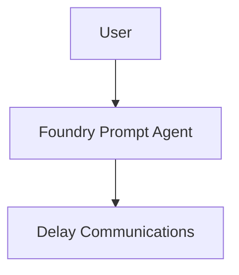
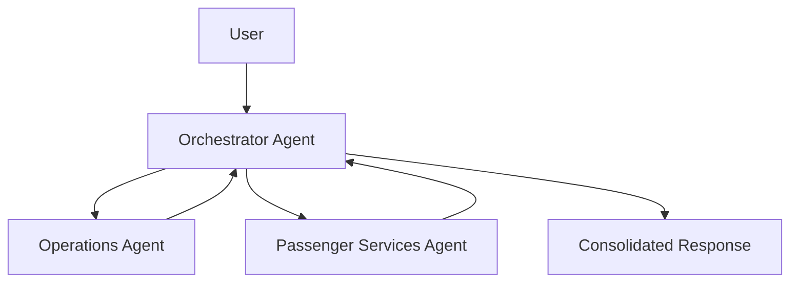

# Slide Deck Outline - Microsoft Foundry Aviation Workshop

## Slide 1 - Title

DP World: Build, Evaluate, Deploy, and Consume AI Agents with Microsoft Foundry

## Slide 2 - Why This Workshop

- Practical introduction to Foundry agents
- Minimal infrastructure setup
- Python-based examples
- Realistic aviation operations scenario

## Slide 3 - Learning Objectives

- Create Foundry agents
- Configure instructions
- Run evaluations
- Deploy agent versions
- Consume deployed agents from Python
- Build and orchestrate agents with Microsoft Agent Framework

## Slide 4 - Workshop Narrative

Build -> Evaluate -> Deploy -> Consume

## Slide 5 - Lab 1 Architecture

## Slide 6 - Lab 1 Scenario

Flight Delay Communications Assistant for DP World

## Slide 7 - Lab 1 Evaluation Focus

- Relevance
- Accuracy
- Completeness
- Tone consistency
- Passenger friendliness

## Slide 8 - Lab 2 Architecture

## Slide 9 - Lab 2 Scenario

Airline disruption management during severe weather

## Slide 10 - Lab 2 Evaluation Focus

- Operations accuracy and completeness
- Passenger policy adherence
- Orchestrator groundedness and consolidation quality

## Slide 11 - Prompt Agent vs Multi-Agent

| Prompt Agent | Multi-Agent |
|---|---|
| Faster to build | Better separation of concerns |
| Best for narrow tasks | Better for broader decision support |
| Easier to manage | Better specialist control |

## Slide 12 - Closing

- Start simple
- Measure quality early
- Deploy intentionally
- Use orchestration when complexity demands it
