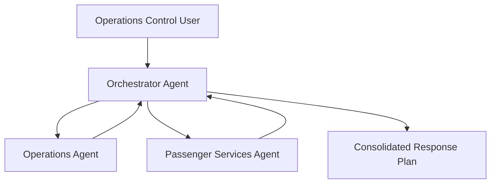

# Lab 2 - Airline Disruption Management Multi-Agent System

## Lab Summary

In this lab, you will build a **multi-agent solution** for Contoso Air using **Microsoft Agent Framework**.

The solution uses:

- An **Operations Agent** for airline operational guidance
- A **Passenger Services Agent** for customer handling guidance
- An **Orchestrator Agent** that consolidates both viewpoints into a single action plan

## Business Scenario

A severe weather event delays flight CA123 by two hours.

Operations Control Center staff need a rapid answer to:

- What operational actions are required?
- What passenger actions are required?
- What should the overall response plan be?

## Architecture



## Learning Objectives

Participants will:

1. Create agents with Microsoft Agent Framework
2. Build specialist agents from local knowledge files
3. Build an orchestrator agent
4. Implement agent-to-agent coordination
5. Test the system locally
6. Register the solution in Microsoft Foundry
7. Run evaluations
8. Deploy the orchestrator
9. Consume the deployed endpoint from Python

## Lab Assets

Use the folders below (paths are relative to the repository root):

- Starter code: `workshop/lab2-disruption-management/starter-code/`
- Solution: `workshop/lab2-disruption-management/solution/`

## Step 1 - Review the Knowledge Sources

Open these files:

- `operations_manual.md`
- `passenger_guidelines.md`

These are the only knowledge sources used in the lab.

This is intentional: participants focus on orchestration, not infrastructure.

## Step 2 - Prepare the Environment

From the workshop root folder:

```bash
cd workshop/lab2-disruption-management/solution
python -m venv .venv
source .venv/bin/activate
pip install -r requirements.txt
cp .env.sample .env
```

> On Windows PowerShell, activate with `.venv\Scripts\Activate.ps1` and use `copy .env.sample .env`.

Populate `.env` with your Foundry project endpoint and model deployment name.

## Step 3 - Build the Specialist Agents

### Operations Agent

Responsibilities:

- Delay procedures
- Gate management
- Aircraft turnaround actions
- Crew coordination
- Diversion handling

Use `operations_manual.md` as the knowledge source.

### Passenger Services Agent

Responsibilities:

- Passenger communications
- Meal vouchers
- Rebooking policies
- Hotel accommodation guidance
- Service recovery actions

Use `passenger_guidelines.md` as the knowledge source.

## Step 4 - Build the Orchestrator Agent

The orchestrator must:

1. Receive the disruption request
2. Run the two specialist agents
3. Consolidate their findings
4. Produce a final action plan with clear sections

Suggested final response format:

- Operational Actions
- Passenger Actions
- Recommended Response Plan
- Immediate Next 30 Minutes

## Step 5 - Test Locally

Run the orchestrator in local mode:

```bash
RUN_MODE=local python orchestrator_agent.py
```

The default sample request is:

```text
Flight CA123 has been delayed by 2 hours due to severe weather. What actions should Contoso Air take?
```

### Expected Output Shape

The answer should include:

- Operational recommendations grounded in the operations manual
- Passenger service actions grounded in the passenger guidelines
- A consolidated, non-conflicting response plan

## Step 6 - Evaluate the Specialists and Orchestrator

Use the evaluation datasets in:

- `solution/evaluation_data/operations_eval.jsonl`
- `solution/evaluation_data/passenger_eval.jsonl`
- `solution/evaluation_data/orchestrator_eval.jsonl`

### Evaluation Plan

#### Operations Agent

Evaluate:

- Accuracy
- Completeness

#### Passenger Services Agent

Evaluate:

- Accuracy
- Policy adherence

#### Orchestrator Agent

Evaluate:

- Response quality
- Groundedness
- Consolidation quality
- Hallucination reduction

### Suggested Expected Outcomes

| Agent | Target Outcome |
|---|---|
| Operations Agent | Recommendations align with the operations manual |
| Passenger Services Agent | Recommendations align with passenger policy guidance |
| Orchestrator Agent | Final plan combines both agents without inventing policy |

### Interpreting Results

- If the operations output is weak, strengthen the operational instructions and structure.
- If the passenger output is weak, tighten policy language and refusal behavior.
- If the orchestrator hallucinates, tell it to synthesize only the specialists' findings.

## Step 7 - Deploy the Orchestrator Agent

Deploy only the orchestrator as the customer-facing hosted agent.

Recommended low-friction path:

1. Open the solution folder in VS Code.
2. Use Microsoft Foundry Toolkit or your preferred hosted-agent workflow.
3. Deploy `orchestrator_agent.py` as a **Responses API** hosted agent.
4. Use the project endpoint from your Foundry workspace.
5. Publish the hosted agent with the name:

`contoso-air-disruption-orchestrator`

### Versioning Guidance

Create a new version whenever you change:

- Specialist instructions
- The orchestration pattern
- Consolidation rules
- Output format expectations

## Step 8 - Consume the Hosted Agent from Python

```bash
python consume_agent.py --prompt "Flight CA123 has been delayed by 2 hours due to severe weather. What actions should Contoso Air take?"
```

The script calls the hosted agent endpoint through the Foundry responses protocol.

## Validation Checklist

Participants should be able to demonstrate:

- Two specialist agents grounded in local markdown files
- An orchestrator that consolidates both outputs
- A successful local test
- Evaluation datasets for each agent tier
- A deployed orchestrator endpoint
- Successful Python consumption of the deployed endpoint

## Troubleshooting

### The orchestrator ignores one specialist

Make the consolidation prompt explicitly require both specialist sections.

### The response invents compensation or hotel approvals

Add an instruction that the orchestrator may only summarize what specialists provided.

### Hosted deployment works locally but fails after publish

Verify the correct environment variables were included in the hosted deployment settings.

### Endpoint invocation returns 401 or 403

Confirm Azure sign-in, project access, and the correct Foundry project endpoint.
